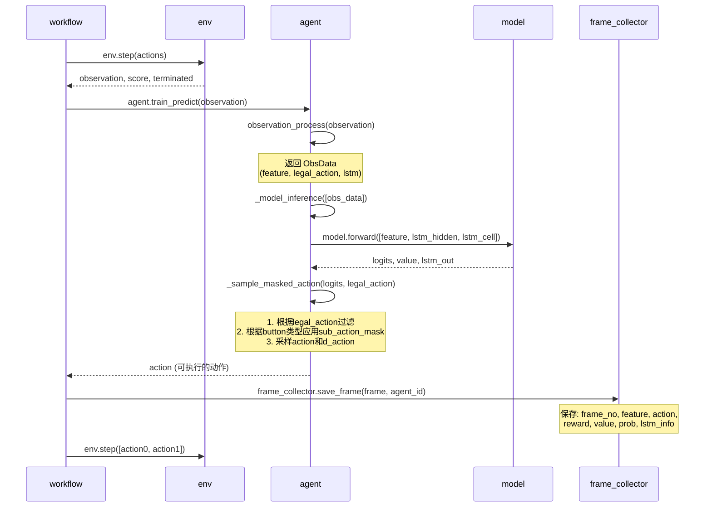

## 一、开发指南重点内容

### 1. 动作空间（Action Space）

#### 层次化动作空间
动作分为三层：
- **What（12个按钮）**: 选择按哪个键
  - None, Move, Normal Attack, Skill 1-4, Heal Skill, Chosen Skill, Recall, Equipment Skill
- **How（16×16方向）**: 往哪个方向拖动
  - Move_X, Move_Z (移动方向)
  - Skill_X, Skill_Z (技能方向)
- **Who（9个target）**: 作用对象是谁
  - None, Enemy, Self, Soldier(4个), Tower


#### 动作空间各维度说明

| Action Class | Type | Description | Dimension |
| --- | --- | --- | --- |
| Button | None | No action | 1 |
| | None | No action | 1 |
| | Move | Move hero | 1 |
| | Normal Attack | Release normal attack | 1 |
| | Skill 1 | Release 1st skill | 1 |
| | Skill 2 | Release 2nd skill | 1 |
| | Skill 3 | Release 3rd skill | 1 |
| | Heal Skill | Release heal skill | 1 |
| | Chosen Skill | Release the chosen skill | 1 |
| | Recall | Start channeling and return to the home fountain after a few seconds if not interrupted | 1 |
| | Skill 4 | Release 4th skill (Only valid for certain heroes) | 1 |
| | Equipment Skill | Release skill provided by certain equipment | 1 |
| Move | Move X | Move direction along X-axis | 16 |
| | Move Z | Move direction along Z-axis | 16 |
| Skill | Skill X | Skill direction along X-axis | 16 |
| | Skill Z | Skill direction along Z-axis | 16 |
| Target | None | Empty target | 1 |
| | Enemy | Enemy player | 1 |
| | Self | Self player | 1 |
| | Soldier | Four nearest soldiers | 4 |
| | Tower | Nearest tower | 1 |

### 2. Action Mask 机制

#### Sub Action Mask (`sub_action_mask`)
- **作用**：根据button类型，过滤掉不需要的action参数
- **原理**：不同技能需要不同的参数组合
  - 方向性技能（如Skill 1, 2）：需要 skill_x, skill_z
  - 目标性技能（如Skill 3）：只需要 target
  - Move：需要 move_x, move_z
- **代码位置**：[`agent.py`](../agent_ppo/agent.py) 的 `_sample_masked_action` 方法


#### Legal Action Mask (`legal_action`)
- **作用**：通过游戏规则直接屏蔽不合理动作
- **例子**：CD中的技能不能释放
- **代码位置**：[`agent.py`](../agent_ppo/agent.py) 的 `_legal_soft_max` 方法


### 3. 观测空间（Observation Space）

#### 特征组成

| **特征区间名** | **特征维数** | **举例** |
| --- | --- | --- |
| Main_camp_hero_state_common_feature | 102 | 血量，位置 |
| Main_camp_hero_private_feature | 133 | 鲁班第几次普攻 |
| Enemy_camp_hero_state_common_feature | 102 | 血量，位置 |
| Enemy_camp_hero_private_feature | 133 | 鲁班第几次普攻 |
| Public_feature | 14 | 敌方小兵是否在我方塔下 |
| Main_camp_soldier_feature | 18*4 | 我方小兵1位置，血量 |
| Enemy_camp_soldier_feature | 18*4 | 敌方小兵1位置，血量 |
| Main_camp_organ_feature | 18*2 | 我方防御塔血量，位置 |
| Enemy_camp_organ_feature | 18*2 | 敌方防御塔血量，位置 |
| Global_feature | 5 | 当前游戏处于前中后哪个时期 |
| demo_custom_feature | 20 | 自定义特征示例 (20维 hero id) |

**总特征维度**: 725维（见 [`conf/conf.py`](../agent_ppo/conf/conf.py) 中的 `SERI_VEC_SPLIT_SHAPE`）

### 4. 奖励设计（Reward）

#### 奖励子项（[`feature/reward_process.py`](../agent_ppo/feature/reward_process.py)）
- `hp_point`: 血量变化
- `tower_hp_point`: 防御塔血量变化 (重要！权重5.0)
- `money`: 获得金币
- `exp`: 获得经验
- `ep_rate`: 能量值
- `death`: 死亡（负奖励-1.0）
- `kill`: 击杀（负奖励-0.6，注意是负数！）
- `last_hit`: 补刀
- `forward`: 向前推进

#### 奖励计算方式（零和设计）
```python
# 我方当前帧血量归一化值
cur_frame_value = 1.0 * main_tower.hp / main_tower.max_hp + 1.0 * main_spring.hp / main_spring.max_hp
# 上一帧值
last_frame_value = ... # 同样的计算
# 当前帧奖励
reward_main = cur_frame_value - last_frame_value
# 最终奖励（零和）
reward_final = reward_main - reward_enemy
```

### 5. 帧（Frame）与步（Step）的关系

- **1 frame ≈ 66 ms**
- **1 step = 6 frame**
- 环境每6帧更新一次，返回新的观测

---

## 二、相关流程

### 1. 完整数据流（从环境到训练）

```mermaid
graph TB
    A[workflow启动] --> B[读取配置 train_env_conf.toml]
    B --> C[while True 主循环]
    C --> D[run_episodes]
    D --> E[env.reset 重置环境]
    E --> F[agent.reset 重置智能体]
    F --> G[agent.load_model 加载模型]
    G --> H[while True Episode循环]
    
    H --> I[observation = env.step返回的观测]
    I --> J[agent.train_predict/agent.eval_predict]
    J --> K[agent.observation_process]
    K --> L[ObsData: feature, legal_action, lstm_cell, lstm_hidden]
    L --> M[agent._model_inference]
    M --> N[model.forward 模型前向传播]
    N --> O[logits, value, lstm_cell_out, lstm_hidden_out]
    O --> P[agent._sample_masked_action]
    P --> Q[考虑 legal_action 和 sub_action_mask]
    Q --> R[ActData: action, d_action, prob, value]
    R --> S[agent.action_process]
    S --> T[action = env可接收的动作格式]
    T --> U[frame_collector.save_frame 保存帧数据]
    U --> V[env.step action 执行动作]
    V --> W[计算 reward]
    W --> X{episode是否结束?}
    X -->|否| I
    X -->|是| Y[frame_collector.save_last_frame]
    Y --> Z[sample_process 样本处理]
    Z --> AA[FrameCollector.sample_process]
    AA --> AB[_calc_reward 计算GAE]
    AB --> AC[_format_data 格式化数据]
    AC --> AD[SampleData列表]
    AD --> AE[agent.learn]
    AE --> AF[algorithm.learn]
    AF --> AG[model.forward + model.compute_loss]
    AG --> AH[反向传播更新参数]
    AH --> C
```



### 2. 详细调用流程（单个step）



---

## 三、代码修改相关

**见注释标注**

## 四、常见修改场景

### 场景1：调整奖励权重

**位置**: [`conf/conf.py`](../agent_ppo/conf/conf.py) 的 `GameConfig.REWARD_WEIGHT_DICT`

```python
REWARD_WEIGHT_DICT = {
    "hp_point": 2.0,
    "tower_hp_point": 5.0,  # 推塔权重，可以增大
    "money": 0.006,
    "kill": -0.6,  # 击杀奖励，可以调整
}
```

### 场景2：修改学习率

**位置**: [`conf/conf.py`](../agent_ppo/conf/conf.py) 的 `Config`

```python
INIT_LEARNING_RATE_START = 1e-3  # 初始学习率
TARGET_LR = 1e-4                 # 目标学习率
TARGET_STEP = 5000               # 衰减步数
```

### 场景3：添加新的奖励项

**位置**: [`feature/reward_process.py`](../agent_ppo/feature/reward_process.py) 的 `GameRewardManager.result()`

```python
def result(self, frame_state):
    reward_dict = {}
    # ... 现有奖励计算 ...
    
    # 添加新奖励项
    reward_dict["new_reward"] = self._calculate_new_reward(frame_state)
    
    return reward_dict
```


### 场景4：修改模型结构

**位置**: [`model/model.py`](../agent_ppo/model/model.py)

```python
# 修改MLP层数
fc_hero_dim_list = [self.single_hero_feature_dim, 512, 256, 96]  # 原来
fc_hero_dim_list = [self.single_hero_feature_dim, 1024, 512, 256, 96]  # 修改后

# ⚠️ 必须同步修改：
# 1. conf.py中的相关维度配置
# 2. 确保forward输出的维度匹配
```