# 简介

## 任务介绍

1v1的目标是：通过算法训练一个智能体（模型），率先摧毁对方的防御塔以获得胜利。若己方防御塔被摧毁，则对方获得胜利。

## 场景介绍

本任务使用**王者荣耀1v1墨家机关道地图**，地图为长条状。 地图两端是双方智能体（红/蓝阵营英雄）的复活点，复活点前方为阵营所属水晶。水晶可以不断生产己方阵营的小兵，小兵将向对方阵营自动前行，可以沿路攻击对方阵营的防御塔、水晶和英雄。水晶前方为己方防御塔，可以攻击进入范围的对方阵营的英雄和小兵。场景存在战争迷雾机制，只有目前单位属于友方阵营或者处于友方阵营观测范围内才能被观测到。


**任务规则：**

- 出场英雄两两循环对战一定轮次，以胜场数作为最终评价标准。
- 不允许修改召唤师技能、装备、铭文等游戏相关配置。

### 出场英雄

**鲁班七号**

- 英雄技能

| | 技能名称 | 技能描述 |
| --- | --- | --- |
| **被动技能** | 火力压制 | 第五次普攻或使用技能后的下次普攻会强化为扫射，扫射对敌人造成3次伤害，每次对英雄造成70~140(+4.5%生命值)的物理伤害(每点额外物理攻击提升0.01%)，对非英雄单位造成120～240(+50%物理攻击)物理伤害。 |
| **一技能** | 河豚手雷 | 投掷一枚河豚手雷，造成450/540/630/720/810/900(+75%物理攻击)物理伤害和25/30/35/40/45/50%减速，持续2秒。同时还会获得敌人视野。 |
| **二技能** | 无敌鲨嘴炮 | 发射一枚火箭炮，火箭炮可击退身前敌人，命中英雄后造成350/420/490/560/630/700（+70%物理加成）点物理伤害，并附带目标已损生命5/6/7/8/9/10%法术伤害。 |
| **三技能** | 空中支援 | 召唤河豚飞艇向指定方向进行空中支援，每秒对范围内随机一个敌人投掷炸弹，造成500/625/750(+75%物理攻击)物理伤害。命中的敌人受到25/37.5/50%减速，持续1秒。河豚飞艇支援时会照亮区域内的视野，支援持续14秒。 |

- 召唤师技能

| 技能名称 | 技能描述 |
| --- | --- |
| 闪现 | 120秒CD：向指定方向位移一段距离。 |

更多信息可前往[王者荣耀官网](https://pvp.qq.com/)或王者荣耀游戏中了解。

# 环境介绍

> 💡 腾讯开悟提供了标准的强化学习开发流程，在正式进入开发之前，请先了解并熟悉[强化学习开发流程](#强化学习开发流程)。

## 强化学习环境

### 环境配置

在智能体和环境的交互中，首先会调用`env.reset`方法，该方法接受一个`usr_conf`参数，这个参数通过读取`train_env_conf.toml`文件的内容来实现定制化的环境配置。因此，用户可以通过修改`train_env_conf.toml`文件中的内容来调整环境配置。

```python
# usr_conf为用户传入的环境配置
observation, state = env.reset(usr_conf=usr_conf)
```

`train_env_conf.toml`中包含以下信息：

| 配置名称 | 支持字段 | 字段描述 |
| --- | --- | --- |
| monitor | monitor_side | 监控上报的阵营，统计指标以该阵营为第一视角。类型整型，取值范围[0,1]，0 表示蓝方阵营，1 表示红方阵营，默认值 0 |
| | auto_switch_monitor_side | 是否启用自动换边逻辑，类型布尔值，true 表示开启，false 表示关闭。 |
| episode | opponent_agent | 对手智能体。取值范围[selfplay, common_ai, 自定义模型 id]，默认值"selfplay" <br> 1. selfplay 表示自对弈<br>2. common_ai 表示对战基于规则的 common_ai <br>3. 自定义的模型 id 表示对战模型管理中的对手模型 |
| | eval_interval | 评估间隔(单位局)，取值范围为大于等于 0 的整数,默认值 10。 |
| | eval_opponent_type | 评估对手类型。取值范围为[selfplay, common_ai, 自定义模型 id]，默认值"common_ai" |
| lineups.blue_camp/lineups.red_camp | hero_id | 英雄ID,合理的范围是133 狄仁杰,508 伽罗,199 公孙离. |

具体使用方式请参考下方提供的示例

```toml
[monitor]
# 监控上报的阵营，统计指标以该阵营为第一视角。类型整型，取值范围[0,1]，0表示蓝方阵营，1表示红方阵营，默认值0。
monitor_side = 0
# 是否启用自动换边逻辑，类型布尔值，true表示开启，false表示关闭。
auto_switch_monitor_side = true

[episode]
# 对手智能体。类型字符串，取值范围[selfplay, common_ai, 自定义模型id]，默认值"selfplay"。
# 1. selfplay 表示自对弈
# 2. common_ai 表示对战基于规则的common_ai
# 2. 自定义的模型id 表示对战模型管理中的对手模型
opponent_agent = "selfplay"
# 评估间隔(单位局)，类型整型，取值范围为大于等于0的整数,默认值10。
eval_interval = 10
# 评估对手类型。类型字符串，取值范围为[selfplay, common_ai, 自定义模型id]，默认值"common_ai"。
eval_opponent_type = "common_ai"

# 蓝方阵容配置。
[[lineups.blue_camp]]
# 英雄ID
# 整数, 合理的范围是133 狄仁杰,508 伽罗,199 公孙离
hero_id = 111

# 红方阵容配置。
[[lineups.red_camp]]
# 英雄ID
# 整数, 合理的范围是133 狄仁杰,508 伽罗,199 公孙离
hero_id = 111
```

> **💡 补充说明**：
> 1. **环境配置仅在训练时生效**，请按上表所述进行`train_env_conf.toml`文件的配置。若配置错误，`env.reset`会在调用超时后返回None，无法获取任务状态，训练不会正常进行，您可以通过监控界面查看**错误日志**进行排查。
> 2. **`common_ai`指的是游戏内置的一个基于规则的AI，能力略弱于普通玩家。通过将monitor_label设置为`common_ai`可在其中一个阵营启用。**
> 3. `usr_conf`使用的是`train_env_conf.toml`文件中的默认配置。
> 4. 模型评估时，用户需要通过开悟平台创建评估任务并完成任务的环境配置。
> 5. **英雄默认配置的召唤师技能为闪现。**

### 环境信息

在调用`env.reset`与`env.step`接口时，会返回环境当前的状态，如下所示。

```python
# usr_conf为用户传入的环境配置
observation, state = env.reset(usr_conf=usr_conf)
# step返回的`frame_no`是任务帧数，`terminated`表示任务结束，`truncated`表示任务中断(超时或异常)
frame_no, observation, score, terminated, truncated, state = env.step(hero_actions)
```

下面会将这些数据进行描述：

#### 环境返回信息

| 数据名 | 数据类型 | 数据描述 |
| --- | --- | --- |
| frame_no | int32 | 当前帧数 |
| observation | Observation | 环境局部观测(按阵容区分) |
| score | ScoreInfo | 得分信息 |
| terminated | int32 | 表示任务结束，即达到任务最大步数 |
| truncated | int32 | 表示任务中断(超时或异常) |
| state | State | 环境全局状态 |

##### 环境数据介绍---英雄特征

对应`observation[agent_id]`

| 数据名 | 数据描述 |
| --- | --- |
| game_id | 对局id |
| player_id | 英雄运行时 id, 以`player_id`区分不同英雄 |
| player_camp | 英雄阵营 |
| observation | 环境内置 feature (已归一化) |
| reward | 各个奖励子项的值，和经过计算的最终奖励 |
| legal_action | legal action |
| sub_action_mask | sub action |
| frame_state | 原始帧状态 |

##### 环境局部观测---帧状态

对应`observation[agent_id]["frame_state"]`

| 数据名 | 数据描述 |
| --- | --- |
| frame_no | 当前帧号 |
| hero_states | 当前帧中所有英雄状态构成的集合 |
| npc_states | 当前帧中所有 NPC 状态构成的集合（野怪，小兵，防御塔等） |
| frame_action | 死亡事件构成的集合 |
| map_state | 地图状态（暂未开放） |

- 该帧状态为 gamecore 返回的原始帧状态, 如需自定义 reward, 自定义特征等, 可自行读取帧状态实现

> 注: 在开发的过程中, 可以直接在相关逻辑处下断点, 直接获取运行时的变量的类型/值/shape

在[数据协议](#数据协议)一章, 将会对相关具体字段进行讲解

##### 环境全局状态

`state`包含环境返回的全局信息。在本环境中，状态`state`与观测`observation`是相同的。为了提高训练效率，我们将 state 设定为空，以避免不必要的数据传递。

### 环境监控信息

监控面板中包含了**env**模块，表示**环境指标**数据，详细说明如下。

| 指标名称 | 说明 |
| --- | --- |
| **win_rate** | 每局游戏结束，在 monitor_side 视角下获得游戏胜利即为 1，游戏失败为 0，游戏超时为 0.5 |
| **tower_hp** | 该面板包含两个指标：<br> self_tower_hp：每局游戏结束时，monitor_side 阵营防御塔剩余血量。 <br> enemy_tower_hp：每局游戏结束时，monitor_side 敌对阵营防御塔剩余血量。 |
| **frame** | 每局游戏结束时，该局游戏的总帧数 |
| **money_per_frame** | 每局游戏结束时，在monitor_side视角获得money的总量除以对局总帧数 |
| **K/D** | 该面板包含两个指标 <br>kill：单局内我方英雄击杀敌方英雄的计数。<br>death：单局内我方英雄被击杀的计数。 |
| **hurt_per_frame** | 该面板包含两个指标 <br>hurt_by_hero：每局游戏结束时，在monitor_side视角受到来自敌方英雄伤害的总量除以对局总帧数                                         <br> hurt_to_hero：每局游戏结束时，在monitor_side视角对敌方英雄造成伤害的总量除以对局总帧数 |

---

### 时间信息

帧(frame)和步(step)存在一定映射关系。

**帧**是场景的一个时间单位，表示场景的一个完整更新周期。在每一帧中，场景的所有元素(如英雄状态等)都会根据当前的状态和输入进行更新。

**步**是强化学习环境中的一个时间单位，表示智能体(agent)在环境中执行一个动作并接收反馈的过程。在每一步中，智能体选择一个动作，环境根据该动作更新状态，并返回新的状态、奖励和终止信号。

在本环境中，1 个 step 由 6 个 frame 组成。这意味着每个动作对应一个步，在每一步中，智能体将在六个连续的帧中执行同一个动作。环境将在每一步结束后更新状态并返回反馈，场景只有在完成六帧后，环境状态才会返回一次状态的更新。

- **步更新**：在每一步中，智能体选择一个动作，环境更新状态并返回。
- **帧更新**：在一步中，场景进行六次帧更新，更新所有场景中对象的状态并渲染新的画面。

帧(frame)，步(step)，现实时间秒(s)和现实时间毫秒(ms)的关系如下：

1 frame 约等于 66 ms

1 step 执行 6 frame

1 s 等于 1000 ms

> **注意** ：由于运行环境的差异，每一帧的时间会在 66 毫秒上下浮动

---

## 强化学习智能体

### 特征处理

对应`observation[agent_id]["observation"]`

#### 特征子类说明

| **特征区间名** | **特征维数** | **举例** |
| --- | --- | --- |
| Main_camp_hero_state_common_feature | 102 | 血量，位置 |
| Main_camp_hero_private_feature | 133 | 鲁班第几次普攻 |
| Enemy_camp_hero_state_common_feature | 102 | 血量，位置 |
| Enemy_camp_hero_private_feature | 133 | 鲁班第几次普攻 |
| Public_feature | 14 | 敌方小兵是否在我方塔下 |
| Main_camp_soldier_feature | 18*4 | 我方小兵1位置，血量 |
| Enemy_camp_soldier_feature | 18*4 | 敌方小兵1位置，血量 |
| Main_camp_organ_feature | 18*2 | 我方防御塔血量，位置 |
| Enemy_camp_organ_feature | 18*2 | 敌方防御塔血量，位置 |
| Global_feature | 5 | 当前游戏处于前中后哪个时期 |
| demo_custom_feature | 20 | 自定义特征示例 (20维 hero id) |

英雄特征经过视野过滤, 当敌方英雄不在视野中时, 敌方英雄部分特征会被置为默认值。

通过在程序中调用`env.step`或`env.reset`，场景会返回当前帧的游戏状态数据，从中可以获取到英雄血量、技能信息、防御塔信息等数值。以下描述了不同数据的计算方法：

- 对于位置特征：考虑到Hok1v1中地图相对于游戏双方而言是镜像对称的，在双方眼中其都处于地图左下角，故使用相对位置特征，将处于地图右上角的英雄的特征数据进行镜像反转，将其转换为左下角位置。

- 对于技能子弹特征：例如貂蝉大招与鲁班七号大招的实时位置，都可以通过帧状态中bullet的位置数据来获得。

- 对于强化普攻类特征：比如鲁班被动，记录其第几次强化特征（one-hot编码），或者当前是否有强化普攻。

### 动作空间

王者1v1强化项目使用层次化的动作空间，将所有动作分为以下几类：

- what，你要按哪个按键：**12个button**

- how，你要往哪个方向拖动按键：**16*16个方向选择**

- who，你的技能作用对象是谁：**9个target（两塔，四兵，一个英雄，一个野怪，以及None）**

> 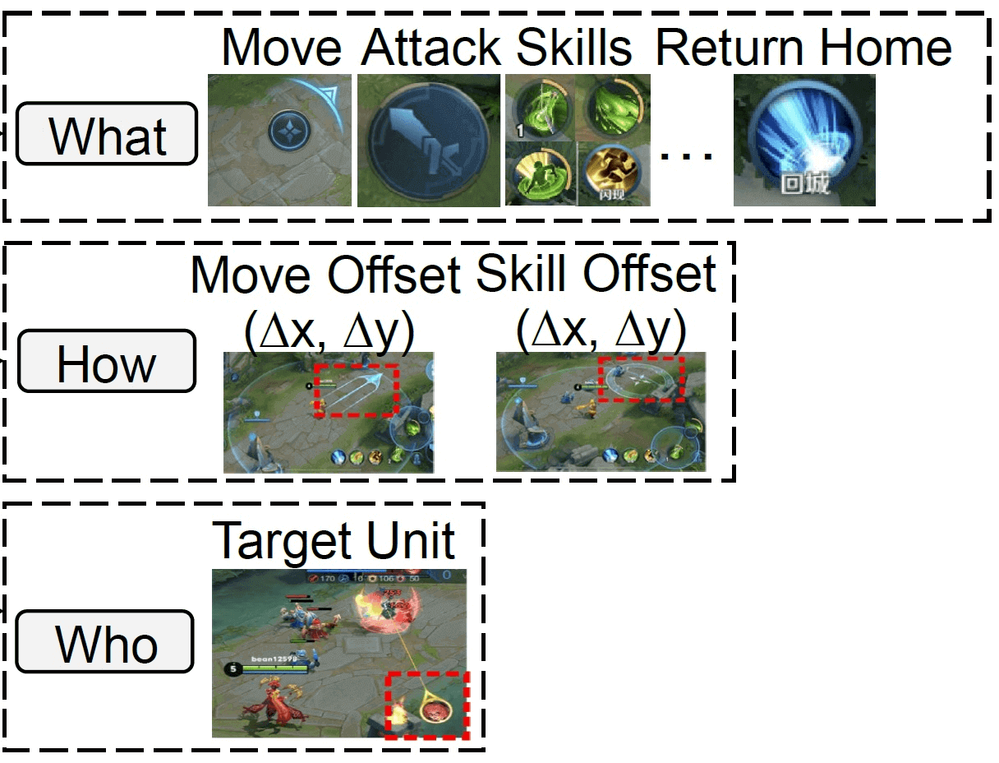

### 动作空间各维度说明

| Action Class | Type | Description | Dimension |
| --- | --- | --- | --- |
| Button | None | No action | 1 |
| | None | No action | 1 |
| | Move | Move hero | 1 |
| | Normal Attack | Release normal attack | 1 |
| | Skill 1 | Release 1st skill | 1 |
| | Skill 2 | Release 2nd skill | 1 |
| | Skill 3 | Release 3rd skill | 1 |
| | Heal Skill | Release heal skill | 1 |
| | Chosen Skill | Release the chosen skill | 1 |
| | Recall | Start channeling and return to the home fountain after a few seconds if not interrupted | 1 |
| | Skill 4 | Release 4th skill (Only valid for certain heroes) | 1 |
| | Equipment Skill | Release skill provided by certain equipment | 1 |
| Move | Move X | Move direction along X-axis | 16 |
| | Move Z | Move direction along Z-axis | 16 |
| Skill | Skill X | Skill direction along X-axis | 16 |
| | Skill Z | Skill direction along Z-axis | 16 |
| Target | None | Empty target | 1 |
| | Enemy | Enemy player | 1 |
| | Self | Self player | 1 |
| | Soldier | Four nearest soldiers | 4 |
| | Tower | Nearest tower | 1 |

### Action Mask 机制

Sub action mask (对应`observation[agent_id]["sub_action_mask"]`):

- 根据button类型对剩余action进行选择性过滤
- 原因：并非所有技能需要拖动按键， 并非所有技能都有target
- 例如 貂蝉1技能与2技能是方向性技能，所以当预测出button为skill1或者skill2时，skill X与Skill Z预测结果是有意义的，对于貂蝉3技能，skill X与skill Z无意义 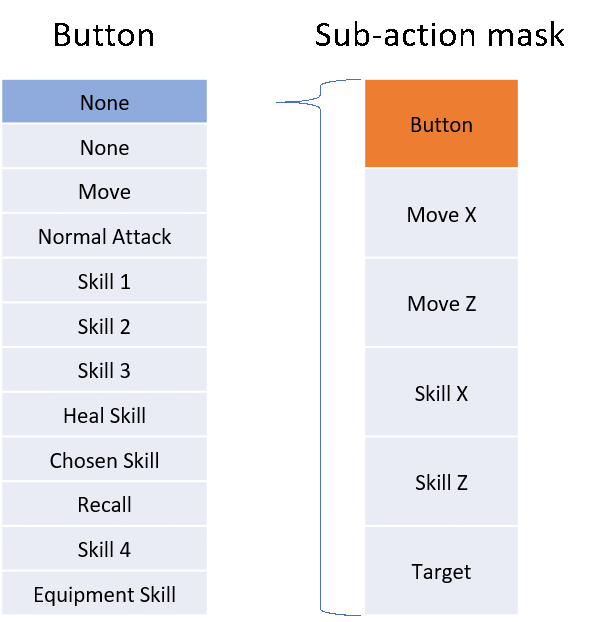

Legal action mask (对应`observation[agent_id]["legal_action"]`):

- 通过游戏规则直接屏蔽掉不合理的预测action
- 比如CD中技能,不能释放
- 可以加快训练速度，避免无意义的探索 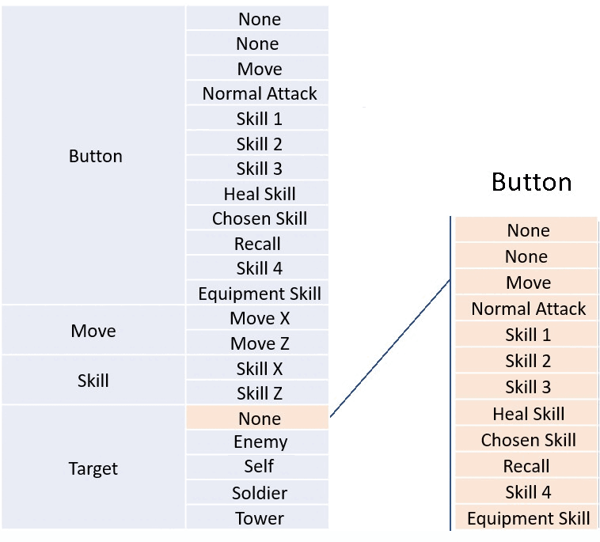

### action具体的执行流程

AI选取action的流程如下：

1. 从which_button中选择采取什么行动

   选择`which_button`维度中具有最大值的索引所对应的**legal action**，作为英雄下一步执行的动作

2. 根据`which_button`选中的结果，去计算要执行的动作需要的参数，分为以下情况：

   - 方向型技能：需要读取位置偏置`offset_x`, `offset_z`和`target`
   - 位置型技能：需要读取位置偏置`offset_x`, `offset_z`和`target`
   - 目标性技能：只需读取target

下面，我们选择一个方向型技能的执行过程作为示例：

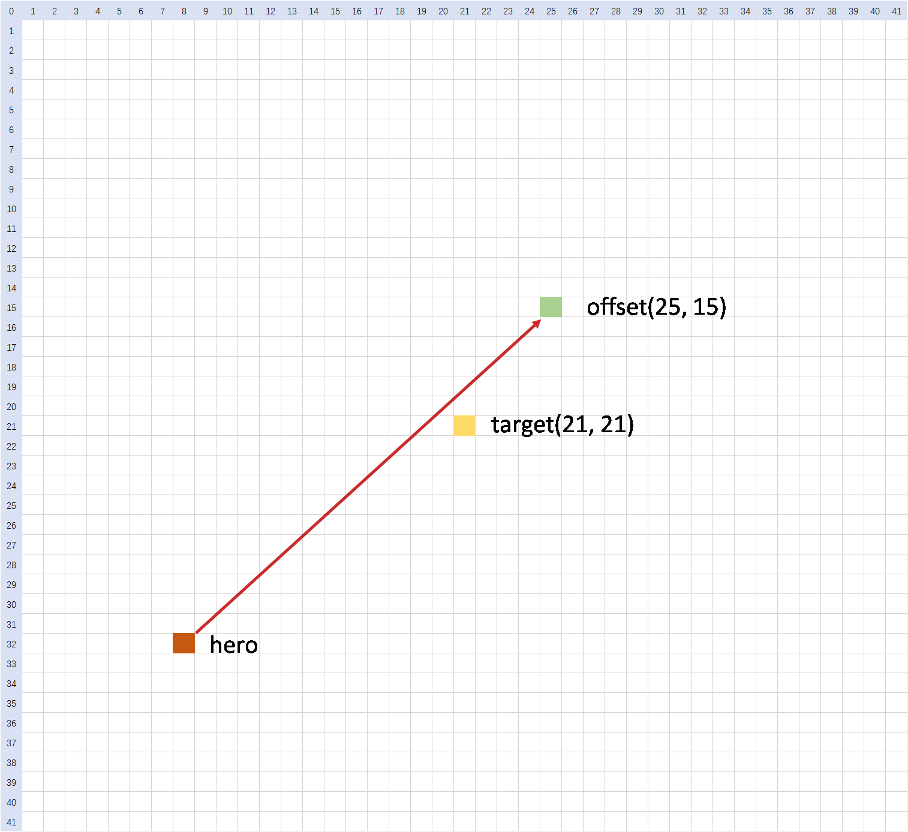

- 绿色方块为main_hero的位置，黄色方块为选中的target的位置。
- 我们以target位置作为offset坐标系的中心点，因此它在offset维度对应的索引为(21, 21)。
- 然后，我们根据offset_x，offset_z的找到最终的位置（下例中以offset_x=25,offset_z=15为例），图中绿色即为以黄色点为中心，offset为(25, 15)的最终目标位置。
- 那么连接红色的英雄位置和绿色方块位置的红色箭头方向即为实际技能释放方向。

> 注:
> - 这里如果直接把 `(skill_x, skill_z)` 设置成 `(21, 21)`, 技能的释放方向就是目标所在的位置
> - 这里图示例子的`offset_x`和`offset_z`是 42 * 42 的, **在1v1的环境中, 应该是 16 * 16**
> - `move_x`和`move_z`同理, 当action为move的时候, 以自身为`target`

---

### 模型保存限制策略

为了避免用户保存模型的频率过于频繁，开悟平台对模型保存会有安全限制，不同的任务会有不同的限制，限制规则详情如下：

- 保存模型的频率限制: 2次/分钟
- 单个任务保存模型的次数限制：400次

---

### 模型评估模式

评估时用户需要在提交任务界面进行配置，包括选择的对手模型、评估局数。另外，训练模式时，用户一般使用agent.train_predict和agent.eval_predict方法进行决策；而在评估模式时，平台会调用agent.exploit方法进行决策，一般情况下，模型在训练和评估时的决策会因算法不同和用户设计不同，而有不同的行为，这部分由用户定义和实现。

评估时将会分别启动两个智能体容器作为AI服务，这个服务只有一个接口即agent.exploit，他的输入即环境env.step返回的state_dicts，输出即作为环境env.step的输入，评估的workflow会分别调用两个智能体的agent.exploit方法进行对战，最后根据智能体胜负情况进行模型能力的判定。以上过程可以描述为下图：

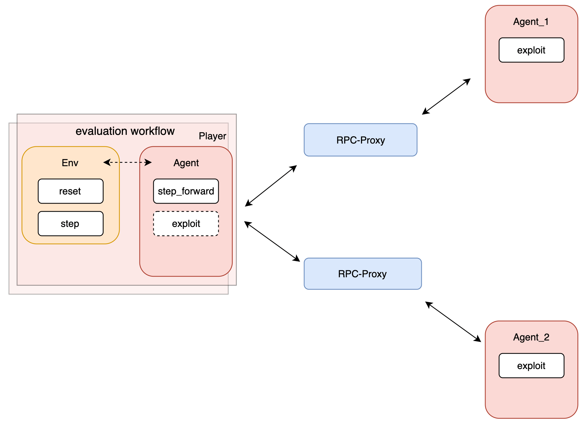

---

# 强化学习开发流程介绍

## 简介

在腾讯开悟平台中，一个训练任务的流程如下图所示：

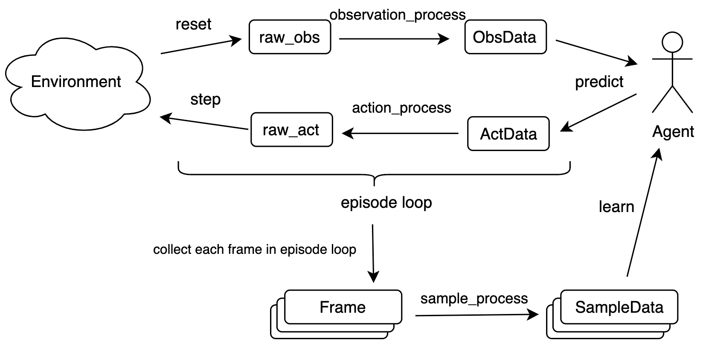

训练任务中包含环境和智能体两大要素，智能体包含一个可被训练的模型，智能体可以对环境给出的观测进行决策，这个决策作用于环境产生新的观测，此过程通过训练工作流控制，不断循环。

另一方面，训练工作流还要收集循环过程中产生的每一帧数据，将他们组合成样本数据，智能体可以将这些样本数据作为算法的输入，通过算法更新模型参数。

如果采用分布式训练，会启动多个容器，此时样本数据需要通过网络通信发送到训练容器（learner）中进行训练，所以要对样本数据进行编码以方便网络发送，同时智能体需要将learner容器上的模型通过网络同步回来。

腾讯开悟提供了标准的强化学习开发流程，帮助用户快速完成相关内容的开发。

**开发流程简介**

为保证训练任务正常进行，我们需要完成以下几部分的开发：

1. **[定义数据结构](#定义数据结构)**：一般情况下，环境产生的原始观测数据不能直接作为智能体的输入，并且不同的用户开发的智能体一般是不一样的，显然不同的智能体的决策、学习方法的输入输出也是不一样的，所以开发的第一步，我们应该定义智能体输入输出的数据结构。

   包括特征（ObsData）、动作（ActData）、样本（SampleData），其中`ObsData`和`ActData`分别作为智能体`predict`方法的输入和输出，`SampleData`作为智能体`learn`方法的输入。

2. **[实现样本处理](#实现样本处理)**：不同的用户实现不同的智能体可能会定义不同的数据结构，但是，环境接口输入输出的数据结构是固定的，因此环境接口的输入输出数据和智能体接口的输入输出数据需要进行转换，所以还需要用户实现这些数据结构的转换方法。

   包括：`observation_process`, `action_process`, `sample_process`。

3. **[算法开发](#算法开发)**：用户需要实现一个 agent，agent中需要实现模型（一般是神经网络模型）和算法（强化学习算法）。agent负责与环境交互，产生预测动作并训练模型。

4. **[实现强化学习训练工作流](#强化学习训练工作流开发)**：在实现了 `数据结构`，`数据处理函数`，`模型`和 `智能体` 以及其他方法（如奖励处理函数）后，我们还需要实现一个强化学习的**训练工作流**`workflow`，将所有组件组合起来完成强化学习训练，即智能体通过不断的与环境交互，获取样本数据，更新并迭代模型，直到模型收敛到我们想要的效果。另外，用户可以对训练参数进行配置，在分布式训练时，开悟平台会启动一个样本池，一个模型同步服务，这些组件的相关参数用户也可以根据自己的需求进行配置。

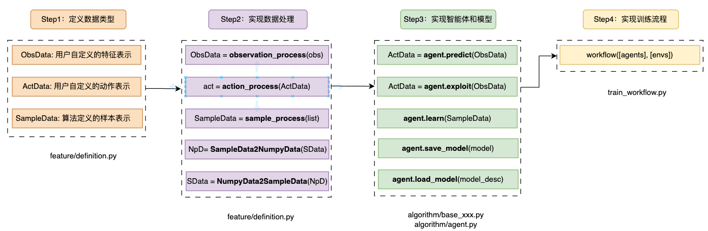

**分布式训练**

在腾讯开悟平台，训练任务的运行分为单机和分布式，单机指的是训练涉及的所有组件(进程)都在一个计算节点上运行，分布式指的是训练涉及的所有组件(进程)会分布在不止一个计算节点上运行，节点之间通过网络组件进行通信，配合完成任务。

如果选择分布式训练模式，开悟平台会启动一个样本池（样本先进先出），用户的agent.learn(samples)调用将会把样本发送到样本池，训练容器会从样本池中采样样本samples将其传入agent.learn(samples)进行训练，此过程是自动的，用户无需开发额外代码。

由于sample的类型是用户定义的 `SampleData`，该类型无法直接进行网络传输，需要统一编码成 `Numpy.array`类型的数据。所以需要用户编写 `SampleData2NumpyData`函数实现 `SampleData`类型数据到 `Numpy.array`类型的转换，同时还要编写 `NumpyData2SampleData`函数实现 `Numpy.array`类型数据到 `SampleData`类型的转换，两个函数作为相对应的编码和解码函数，每一位数据都需要对齐，否则将产生数据错误，无法有效训练。

另外，由于模型在训练容器（learner）进行训练，用户需要按需在恰当时机从训练容器加载模型。开悟平台会在某个容器中启动一个模型同步服务，用户在`workflow`中调用agent.load_model(id="latest")将会加载最新模型，若希望加载中间模型则可以指定id，若希望加载随机模型则调用agent.load_model(id="random")。

最后，是用户可以配置的参数。根据SampleData转换成的Numpy.array的数据长度设置`<agent_算法名称>/conf/conf.py`中配置项`SAMPLE_DIM`的值。还有样本池和模型同步服务的参数。

```python
class Config:
    # **注意**，此项必须正确配置，应该与definition.py中的NumpyData2SampleData函数数据对齐，否则可能报样本维度错误
    SAMPLE_DIM = 15584
```

> 样本池和模型同步服务的参数

```python
# 样本池容量大小
replay_buffer_capacity = 4096
# 该配置值确定了样本池中有多少样本后开始训练，如preload_ratio=1表示样本池满后开始训练，preload_ratio=2表示样本池中样本达到一半时开始训练
preload_ratio = 1
# 每次训练从样本池中采样的样本数量
train_batch_size = 256
# 每次训练的训练间隔，可以通过这个数值控制样本生成消耗比
learner_train_sleep_seconds = 0.0001
# 模型池大小，如果是采用最新的模型则设置为1; 需要采用历史模型则该值设置为需要的比如50, 模型池也是FIFO模式, 训练产生新模型淘汰旧模型
modelpool_max_save_model_count = 1
```

分布式训练架构如下图：

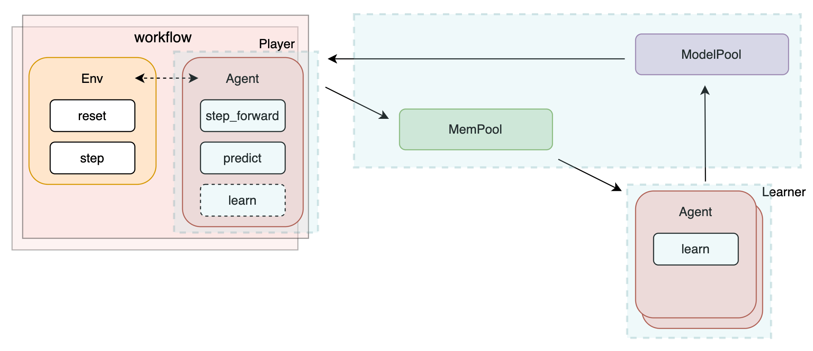

---

接下来，我们将详细介绍开发流程中每一个模块的实现逻辑和核心函数。

## 开发流程

首先，我们先简单了解下完整的代码包目录，后续的开发工作将在不同的文件中进行。

完整的代码包目录结构如下：

## 目录介绍

| 目录名 | 介绍 |
| --- | --- |
| **<agent_算法名称>** | 算法子目录，用户的大部分代码开发在这个目录中，一般一个代码包中会包含多个算法子目录 |
| **diy** | Do it yourself 用户自定义算法的子目录 |
| **conf** | 配置文件 |
| **kaiwu.json** | 评估时指定对手模型的配置文件 |
| **train_test.py** | 代码正确性测试脚本 |

### 代码包目录介绍

各个算法的子目录结构如下：

| 目录/文件名 | 介绍 |
| --- | --- |
| **algorithm/** | 算法相关，主要是 算法 的实现，可以实现多个算法，详情见[算法开发](#算法开发) |
| **feature/** | 特征相关，主要包含用户自定义的数据结构和数据处理方法，以及特征和奖励的计算，详情见[实现样本处理](#实现样本处理) |
| **model/** | 模型相关，主要是模型的实现，是一个Model类 |
| **conf/** | 该智能体下的配置，用户可以增加配置或修改配置 |
| **agent.py** | 智能体相关，主要是 agent 的实现，包含预测等，详情见[智能体开发](#智能体开发) |
| **workflow/** | 强化学习的训练流程，详情见[强化学习训练流程开发](#强化学习训练工作流开发) |

---

### 智能体开发

#### 定义数据结构

环境返回的原始观测信息 `obs`的数据结构可以参考协议，这里的 `obs` 已经做了一定的**数据预处理**工作，但是智能体是由用户设计和实现的，环境使用的`obs`, `act`等与智能体的输入输出是存在差异的，所以要先定义数据结构（类）再进行数据转换，包括：包括特征（ObsData）、动作（ActData）、样本（SampleData），这部分的代码，都需要实现在`<agent_算法名称>/feature/definition.py`中。

首先需要定义相关的数据结构（类）包含观测数据ObsData，动作数据ActData，和样本数据SampleData, 其中：

- ObsData和ActData分别表示智能体预测的输入和输出，将会由agent.predict使用；
- SampleData为样本的数据类型，样本数据将会被agent.learn中的代码进行处理用于模型的训练。

在`definition.py`文件中通过`create_cls`函数创建数据结构（类）。`create_cls`的第一个参数为类型名称，剩余参数为类的属性，属性默认值为None。这些数据结构（类）包含哪些属性完全由用户自定义，属性名称和属性数量没有限制。

**核心函数介绍**

##### `create_cls`

- **Introduction**: 用于动态创建一个类，这个类包含哪些属性完全由用户自定义，属性名称和属性数量没有限制
- **Parameters**:
  - `第一个参数`: 字符串类型，表示为定义类型的名称
  - `其余参数`: 定义类的属性名称，属性默认值为None

示例代码：

```python
# The create_cls function is used to dynamically create a class. The first parameter of the function is the type name,
# and the remaining parameters are the attributes of the class, which should have a default value of None.
# create_cls函数用于动态创建一个类，函数第一个参数为类型名称，剩余参数为类的属性，属性默认值应设为None
ObsData = create_cls("ObsData", 
    feature=None, 
    legal_action=None,
    lstm_cell=None,
    lstm_hidden=None,
)

ActData = create_cls("ActData", 
    action=None, 
    d_action=None,
    prob=None,
    value=None,
    lstm_cell=None,
    lstm_hidden=None,
)

SampleData = create_cls("SampleData", 
    npdata=None
)
```

> **注意**：必须使用`create_cls`这个函数创建这些类，若使用普通的类定义方法（class 类名）将无法在开悟平台正确运行。

---

#### 实现样本处理

用户需要在`<agent_算法名称>/feature/definition.py`中实现样本处理的代码。需要实现样本处理的工具有：`sample_process`, `FrameCollector`。

`sample_process`：用于将游戏环境中收集的游戏帧集合转换为样本集合，输入为FrameCollector类型，输出为SampleData类型的数据组成的列表

`FrameCollector`：一方面作为收集器收集游戏的每一帧数据，另一方面，实现了样本处理的绝大部分逻辑

在`<agent_算法名称>/feature/definition.py`中我们为学员们提供了这部分的示例实现代码，代码较长，用户可以直接参考源码阅读。

> **注意**：sample_process函数头必须包含一个装饰器@attached，否则无法在开悟平台正确运行，代码默认已实现，注意不要删除。

**核心函数介绍**

##### `sample_process`

- **Introduction**: 将环境数据帧的集合转换为样本的集合
- **Parameters**:
  - `collector`: FrameCollector类型
- **Return type**:
  - list(SampleData)类型，SampleData类型的数据组成的列表

示例代码：

```python
@attached
def sample_process(collector):
    return collector.sample_process()
```

为了支持分布式训练，样本数据需要进行网络传输，由于SampleData无法直接进行网络传输，需要先转换成Numpy的Array，待传输到对端之后再由np.Array转换成SampleData。所以用户需要实现两个转换函数`SampleData2NumpyData`和`NumpyData2SampleData`，这两个函数互为反函数。以下是代码包中这两个函数的示例代码：

> **注意**：这两个函数的实现都必须包含一个装饰器@attached

##### `SampleData2NumpyData`

- **Introduction**: 将SampleData转换为NumpyData
- **Parameters**:
  - `g_data`: SampleData 类型
- **Return type**:
  - Numpy.array类型

示例代码：

```python
@attached
def SampleData2NumpyData(g_data):
    return g_data.npdata
```

##### `NumpyData2SampleData`

- **Introduction**: 将NumpyData转换为SampleData
- **Parameters**:
  - `s_data`: Numpy.array 类型
- **Return type**:
  - SampleData类型

示例代码：

```python
@attached
def NumpyData2SampleData(s_data):
    return SampleData(npdata=s_data)
```

---

#### 奖励设计

这里的奖励特指强化学习中的Reward，注意要与环境反馈的Score进行区分。Score用于衡量玩家在任务中的表现，也作为衡量强化学习训练后的模型的优劣。

代码包里提供了一些奖励的实现，可以参考`<agent_算法名称>/feature/reward_process.py`里的`GameRewardManager`类的设计和实现，用户还可以在这个函数中去实现自己的reward设计，这部分非常开放，回报设计的依据不一定只是环境给出的信息，也可以是用户对问题的理解、经验或者知识，建议用户根据对问题和强化学习算法的理解，去设计和实现自己的reward。

参考代码包中GameRewardManager对reward的实现，同学们可以通过设计多个奖励子项来帮助智能体获得更好的效果。以下是推荐设计的奖励子项：

| **reward** | **类型** | **描述** |
| --- | --- | --- |
| hp_point | dense | the rate of health point of hero |
| tower_hp_point | dense | the rate of health point of tower |
| money (gold) | dense | the total gold gained |
| ep_rate | dense | the rate of mana point |
| death | sparse | being killed |
| kill | sparse | killing an enemy hero |
| exp | dense | the experience gained |
| last_hit | sparse | the last hit for soldier |

### 回报计算方法

- 默认推荐使用零和reward设计方案，以当前决策帧和上一决策帧的相关数值差作为agent的reward，两个agent的同类reward项相减作为最终reward，最终多种reward项加权求和作为最终的reward返回。回报计算方法不止一种，我们鼓励用户进行创新。

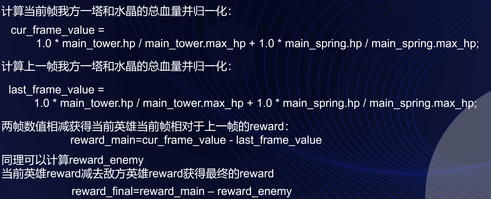

> **注意**：
> 1. 由于最终的reward是加权求和，各个回报子项的权重是非常重要的。例如，击杀会带来金币和经验的奖励，如果击杀回报权重太高，则可能会导致不推塔只击杀，偏离学习目标。
> 2. exp 在英雄满级后置 0，因此可能出现非零和情况

---

#### 算法开发

在代码包中，我们提供了不同的算法子目录，给用户进行算法的实现，每个算法的开发流程都是一致的，接下来我们描述如何实现：

首先，如果我们需要实现一个神经网络模型，我们需要在文件`<agent_算法名称>/model/model.py`中实现一个`Model`类，即用pytorch实现一个神经网络模型。

然后，我们需要在文件`<agent_算法名称>/agent.py`中实现一个 `Agent`类。注意`Agent`类需要继承 `kaiwu_agent.agent.base_agent` 的 `BaseAgent` 类，`Agent`类的实现需要符合`BaseAgent`类的接口规范。或者，如果在`<agent_算法名称>/algorithm/`文件夹下实现了算法，`Agent`类需要继承此算法类。

> **注意**：`Agent`类必须使用@attached装饰器，代码默认已实现，注意不要删除。

示例代码：

```python
class BaseAgent:
    """
    Agent 的基类，所有的 Agent 都应该继承自这个类"""
    def __init__(self, agent_type="player", device=None, logger=None, monitor=None) -> None:
        raise NotImplementedError

    def learn(self, list_sample_data) -> dict:
        """
        用于学习的函数，接受一个 SampleData 的列表
        """
        raise NotImplementedError

    def predict(self, list_obs_data: list) -> list:
        """
        用于获取动作的函数，接受一个 ObsData 的列表, 返回一个动作列表
        """
        raise NotImplementedError

    def exploit(self, list_obs_data: list) -> list:
        """
        用于获取动作的函数，接受一个 ObsData 的列表, 返回一个动作列表
        """
        raise NotImplementedError

    def save_model(self, path, id='1'):
        raise NotImplementedError

    def load_model(self, path, id='1'):
        raise NotImplementedError
```

**核心函数介绍**

##### `predict`

- **Introduction**: 该方法通过调用模型进行预测，是智能体训练时调用的方法，一般是依策略的概率分布采样或引入随机概率。
- **Parameters**:
  - `list_obs_data`: list(ObsData) 类型，使用用户自定义的ObsData作为输入进行预测，predict可进行批预测，所以传入ObsData的列表
- **Return type**:
  - list(ActData) 类型，预测结果是用户定义的ActData类型，predict可进行批预测，所以类型是list

示例代码：

```python
"""
<agent_算法名称>/agent.py
"""
@attached
class Agent(BaseAgent):
    @predict_wrapper
    def predict(self, list_obs_data):
        return self.__predict_detail(list_obs_data, exploit_flag=False)
```

##### `exploit`

- **Introduction**: 该方法也通过调用模型进行预测，是智能体在评估时调用的方法，一般是选取策略中概率最高的动作或者策略认为最优的动作。
- **Parameters**:
  - `list_obs_data`: list(ObsData) 类型，使用用户自定义的ObsData作为输入进行预测，exploit可进行批预测，所以传入ObsData的列表
- **Return type**:
  - list(ActData) 类型，预测结果是用户定义的ActData类型，exploit可进行批预测，所以类型是list

示例代码：

```python
"""
<agent_算法名称>/agent.py
"""
@attached
class Agent(BaseAgent):
    @exploit_wrapper
    def exploit(self, list_obs_data):
        return self.__predict_detail(list_obs_data, exploit_flag=True)
```

##### `learn`

- **Introduction**: 该方法主要负责消费样本进行模型训练，需要实现核心的强化学习算法。
- **Parameters**:
  - `list_sample_data`: list(SampleData) 类型，使用用户自定义的SampleData作为输入进行训练，一般进行批训练，所以传入SampleData的列表

示例代码：

```python
"""
<agent_算法名称>/agent.py
"""
@attached
class Agent(BaseAgent):
    @learn_wrapper
    def learn(self, list_sample_data):
        # 算法详细代码不在此处展示
        loss = policy_loss + Config.VALUE_LOSS_COEFF * value_loss
        loss.backward()
        grad_norm = torch.nn.utils.clip_grad_norm_(self.model.parameters(), 0.5)
        # Gradient Descent
        # 梯度下降
        self.optimizer.step()
```

##### `save_model`

- **Introduction**: 该方法主要负责模型的保存，注意模型默认的前缀model.ckpt-不要改动，可以通过id区分不同的模型。如果我们的模型是标准的pytorch格式，`save_model`方法中可以直接调用torch.save。
- **Parameters**:
  - `path`: 字符串类型，表示保存模型的路径 
  - `id`: 字符串类型，表示保存模型的唯一id

示例代码：

```python
"""
<agent_算法名称>/agent.py
"""
@attached
class Agent(BaseAgent):
    @save_model_wrapper
    def save_model(self, path=None, id="1"):
        # To save the model, it can consist of multiple files,
        # and it is important to ensure that each filename includes the "model.ckpt-id" field.
        # 保存模型, 可以是多个文件, 需要确保每个文件名里包括了model.ckpt-id字段
        model_file_path = f"{path}/model.ckpt-{str(id)}.pkl"

        # Copy the model's state dictionary to the CPU
        # 将模型的状态字典拷贝到CPU
        model_state_dict_cpu = {k: v.clone().cpu() for k, v in self.model.state_dict().items()}
        torch.save(model_state_dict_cpu, model_file_path)

        self.logger.info(f"save model {model_file_path} successfully")
```

##### `load_model`

- **Introduction**: 该方法主要负责模型的保存，注意模型默认的前缀model.ckpt-不要改动，可以通过id区分不同的模型。如果我们的模型是标准的pytorch格式，`load_model`方法中可以直接调用torch.load。
- **Parameters**:
  - `path`: 字符串类型，表示载入模型的路径
  - `id`: 字符串类型，表示载入模型的唯一id

示例代码：

```python
"""
<agent_算法名称>/agent.py
"""
@attached
class Agent(BaseAgent):
    @load_model_wrapper
    def load_model(self, path=None, id="1"):
        # When loading the model, you can load multiple files,
        # and it is important to ensure that each filename matches the one used during the save_model process.
        # 加载模型, 可以加载多个文件, 注意每个文件名需要和save_model时保持一致
        model_file_path = f"{path}/model.ckpt-{str(id)}.pkl"
        self.model.load_state_dict(
            torch.load(model_file_path, map_location=self.device),
        )

        self.logger.info(f"load model {model_file_path} successfully")
```

> **注意**：
> 1. 训练和评估时智能体行为有所不同，`predict`和`exploit`的接口是完全不同的，用户需要进行区分
> 2. agent.predict调用会在另一个进程中进行批量预测以提高算力利用率，此过程是自动的，执行结果与函数调用没有区别，用户无需开发额外代码且无需关心实现的逻辑。
> 3. `Agent`类的五个核心方法必须使用相应的装饰器，例如learn方法必须使用@learn_wrapper装饰器。代码默认已实现，注意不要删除。
> 4. 如果在本地训练DIY算法时，遇到电脑卡顿，CPU占用过多的情况，请在算法文件夹下的`agent.py`中通过以下代码调整线程数，推荐设置为1。

```python
torch.set_num_threads(1)
torch.set_num_interop_threads(1)
```

最后Agent类还要实现两个方法`observation_process`和`action_process`，如上节介绍，目的是将环境接口的输入输出数据和智能体接口的输入输出数据进行转换，示例代码如下：

```python
def action_process(self, state_dict, act_data, is_stochastic):
    frame_no = state_dict["frame_state"]['frameNo']
    if frame_no < START_FRAME:
        act_data.action = FORWARD_ACTION
    if is_stochastic:
        # 采用随机采样动作 action
        return act_data.action
    else:
        # 采用最大概率动作 d_action
        return act_data.d_action
    
def observation_process(self, state_dict):
    feature_vec, legal_action = (
        state_dict["observation"],
        state_dict["legal_action"],
    )
    return ObsData(feature=feature_vec, legal_action=legal_action, lstm_cell=self.lstm_cell, lstm_hidden=self.lstm_hidden)
```

---

### 强化学习训练工作流开发

完成了上述开发步骤之后，需要再实现一个强化学习的训练工作流 - `workflow`，来让智能体 `Agent` 和环境 `Environment` 不断的交互从而产生训练样本并更新模型。腾讯开悟平台的强化学习训练工作流包含：

1. 获取env和agent，实例化游戏帧收集器FrameCollector
2. 监控数据初始化
3. 进入训练主循环
   1. 使用用户自定义的配置调用env.reset获得环境的第一帧
   2. 调用agent.reset重置智能体，调用frame_collector.reset重置游戏帧收集器FrameCollector
   3. 根据训练或评估调用agent.load_model为不同智能体加载不同的模型
   4. 进入环境的episode循环
      1. 调用agent.train_predict(state_dict)进行训练时的决策
         1. 调用agent.observation_process进行特征处理，得到ObsData类型的数据
         2. 调用agent.predict, 执行执行智能体模型的决策，得到ActData类型的数据
         3. 调用agent.action_process将上一步的ActData类型数据转换为env能处理的动作
      2. 计算 reward
      3. 收集当前帧的所有信息
      4. 调用env.step，执行动作与环境交互, 获取下一帧的状态
      5. 若episode结束或达到训练条件，调用sample_process处理当前收集到的所有信息并生成样本
      6. 若有样本生成则调用agent.learn进行训练
   5. 以适当时间上报适当的监控数据
4. 训练结束，保存最终模型

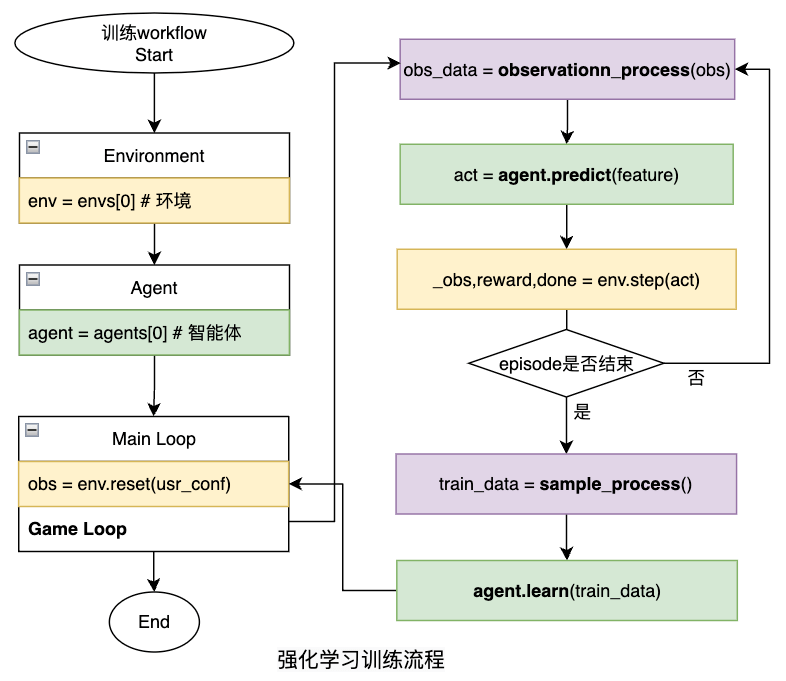

为了实现这个强化学习训练工作流，我们需要在文件`<agent_算法名称>/train_workflow.py`中实现一个 `workflow`方法。

**核心函数介绍**

##### `workflow`

- **Introduction**: 该函数实现强化学习训练工作流。
- **Parameters**:
  - `envs`: list类型，环境列表，开悟框架会通过调用开悟场景库，得到相应的环境, 并作为输入传入 `workflow`。
  - `agents`: list类型，智能体列表，通过调用用户实现的 `<agent_算法名称>/agent.py` 实例化 Agent, 并作为输入传入 `workflow`。
  - `logger`: Logger类型，开悟提供的日志组件，接口与常见的 `python` 的 `logging` 库一致。
  - `monitor`: Monitor类型，开悟提供的监控组件。

> **注意**：workflow函数需要装饰器@attached，该代码不能删除！

示例代码：

```python
"""
PPO/train_workflow.py
"""
@attached
def workflow(envs, agents, logger=None, monitor=None):
    # 智能体是否进行训练，与do_predicts相对应
    do_learns = [True, True]
    last_save_model_time = time.time()

    while True:
        for g_data in run_episodes(envs, agents, logger, monitor):
            for index, (d_learn, agent) in enumerate(zip(do_learns, agents)):
                if d_learn and len(g_data[index]) > 0:
                    # learner 采用 while true 训练，此处 learn 实际为发送样本
                    agent.learn(g_data[index])
            g_data.clear()
            
```

`workflow`的输入接口为：

- **envs**：环境列表，通过调用开悟场景库， `env = kaiwu_env.make("hok1v1")` 得到Hok1v1环境, 并作为输入传入 `workflow`。
- **agents**：智能体列表，通过调用用户实现的 `xxx/algorithm/agent.py` 实例化 Agent, 并作为输入传入 `workflow`。
- **logger**：日志，开悟提供的日志组件，接口与常见的 `python` 的 `logging` 库一致。
- **monitor**：监控，开悟提供的监控组件，详情参见[监控介绍](#监控介绍)。

下面展示了如何使用 `usr_conf` 来实现自定义的环境配置：

```python
for episode in range(EPISODES):
    # 用户自定义的环境启动配置
    usr_conf = {
        "diy":{
            "monitor_side": 1,
            "monitor_label": "selfplay",
            "lineups": [[{'hero_id': 133}], [{'hero_id': 508}]],
        }
    }

    # 重置环境, 并获取初始状态
    obs, state_dicts = env.reset(usr_conf=usr_conf)

    # 重置agent
    for i, agent in enumerate(agents):
        player_id = state_dicts[i]["player_id"]
        camp = state_dicts[i]["player_camp"]
        agent.reset(camp, player_id)
        agent.load_model(id="latest")
    
    # 重置游戏帧收集器
    frame_collector.reset(num_agents=agent_num)

```

下面是一个任务循环简单的伪代码实现，基本是开发者之前实现的各个组件的调用：

```python
# episode循环
while True:
    actions = [NONE_ACTION, ] * agent_num
    for index, (d_predict, agent) in enumerate(zip(do_predicts, agents)):
        if d_predict:
            if not is_eval:
                actions[index] = agent.train_predict(state_dicts[index])
            else:
                actions[index] = agent.eval_predict(state_dicts[index])
            
            # 计算 reward
            reward = agents[i].reward_manager.result(state_dicts[i]["frame_state"])
            state_dicts[i]["reward"] = reward
            # 构造并保存游戏帧
            frame = build_frame(agent, state_dicts[index])
            frame_collector.save_frame(frame, agent_id=index)
            

    # Interact with the environment, execute actions, get the next state
    # 与环境交互, 执行动作, 获取下一步的状态
    frame_no, _, _, terminated, truncated, state_dicts = env.step(actions)

    step += 1

    # 正常结束或超时退出
    if terminated or truncated:
        for index, (d_predict, agent) in enumerate(zip(do_predicts, agents)):
            if d_predict and not is_eval:
                frame_collector.save_last_frame(
                    agent_id=index,
                    reward=state_dicts[index]["reward"]["reward_sum"],
                )
        if len(frame_collector) > 0 and not is_eval:
            list_agents_samples = sample_process(frame_collector)
            yield list_agents_samples
        break

```

下面是监控功能的一个展示：

```python
monitor_data = {
    "reward": total_reward_dicts[main_agent]["reward_sum"],
    "diy_1": total_reward_dicts[main_agent]["forward"],
}

if monitor:
    monitor.put_data({os.getpid(): monitor_data})
    
```

`workflow`的另外两个传入参数是monitor和logger，他们皆已被实例化，用户可以把他作为工具根据需要在自己的代码中使用。

### 训练中评估

注意在上面`workflow`的伪代码中，根据is_eval的实际布尔值分别调用了agent.train_predict和agent.eval_predict，这是由于我们的workflow支持在训练过程中边训练边与用户指定的对手模型进行对战评估。用户需要在usr_conf中设置`monitor_side`作为被评估对象，另一个智能体作为评估的对手，对手智能体应根据用户的意图通过agent.load_model()加载期望的模型（或common_ai），训练时评估的数据将会在监控中展示。

评估时的对手模型可以有两种选择，一种是`common_ai`，这是内置在环境中一个由规则实现的AI，他的能力的固定的；另一种可以是用户保存到模型管理的模型，用户可以将期望用作对手模型的模型id配置在`kaiwu.json`中（模型id可以前往平台的模型管理查看），我们最多支持配置3个模型，但在一次训练中，建议同学只选择其中一个模型作为评估的对手。以下是kaiwu.json的配置示例：

```json
{
    "model_pool": [609, 608]
}
```

下图是开悟平台模型管理的截图，我们可以将模型id写入kaiwu.json用于训练时的评估，注意只有`检测成功`的模型才是有效的。

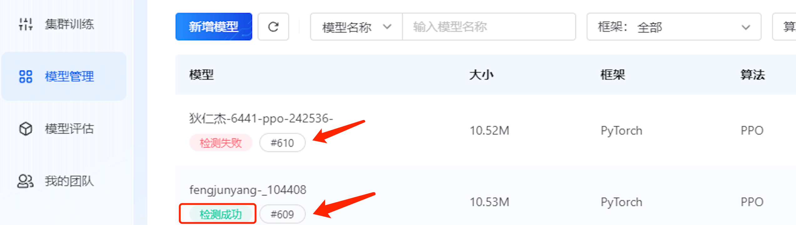

以下是使用对手模型进行训练中评估的示例代码：

```python
"""
PPO/train_workflow.py
"""
def run_episodes(envs, agents, logger, monitor):
    # 以下是伪代码
    # 如果是训练中的评估对局，有以下利用方式
    if is_eval:
        # 1. 使用 common_ai
        opponent_agent = "common_ai"

        # 2. 使用对手模型 609
        opponent_agent = "609"

        # 3. 从 common_ai 和对手模型列表中随机选择
        opponent_agent_list = ["common_ai", "609", "608"]
        opponent_agent = opponent_agent_list[random.randint(0,len(opponent_agent_list))]
        
    # 后续代码将根据 opponent_model 进行 agent 的加载

```

> **注意**：如果选择使用对手模型，那对手模型只能是当前兼容版本的模型，如果版本存在变更导致不兼容性问题，强行使用会导致`加载模型失败`的报错。

### 模型保存

代码包中提供的`workflow`示例代码会保存模型，用户也可以在`workflow`代码中的任意时机调用`agent.save_model`保存中间模型。

注意：虽然`agent.save_model`接受`path`和`id`两个参数，但在开悟平台训练时，`workflow`中调用该接口传入的参数会被框架覆盖成实际的模型保存路径以及最新的训练步数。

```python
"""
PPO/train_workflow.py
"""
@attached
def workflow(envs, agents, logger=None, monitor=None):
    # 以下是伪代码
    if Condition satisfied:
        agents[0].save_model()
        last_save_model_time = time.time()
```

用户也可以在`workflow`代码中的任意时机调用`agent.save_model`保存中间模型。

注意：虽然`agent.save_model`接受`path`和`id`两个参数，但在分布式训练时，`workflow`中调用该接口传入的参数会被框架覆盖成实际的模型保存路径以及最新的训练步数。

为了避免用户保存模型的频率过于频繁，开悟平台对模型保存会有安全限制，不同的任务会有不同的限制，对于本环境，限制规则如下：

- 保存模型的频率限制: 2次/分钟
- 单个任务保存模型的次数限制：400次

---

## 评估模式

开悟平台支持评估模式，帮助用户在训练后评估模型的能力。评估时用户需要在提交任务界面进行配置，包括选择的对手模型、评估局数。另外，训练模式时，用户一般使用agent.train_predict和agent.eval_predict方法进行决策；而在评估模式时，平台会调用agent.exploit方法进行决策，一般情况下，模型在训练和评估时的决策会因算法不同和用户设计不同，而有不同的行为，这部分由用户定义和实现。

评估时将会分别启动两个智能体容器作为AI服务，这个服务只有一个接口即agent.exploit，他的输入即环境env.step返回的state_dicts，输出即作为环境env.step的输入，评估的workflow会分别调用两个智能体的agent.exploit方法进行对战，最后根据智能体胜负情况进行模型能力的判定。以上过程可以描述为下图：


---

## 使用预训练模型

用户在训练模型的过程中，可能希望加载过去已训练过的模型而不是从零开始训练。此时，可以使用开悟平台的**使用预训练模型**功能，用户可以在提交训练前选择模型管理中已有的模型，在训练开始前，智能体会预先加载这个模型。特别要注意的是，如果model的结构进行了变更，旧的模型参数将无法加载到新的模型结构中，此时会产生模型加载的报错。

---

## 优化方向与建议

我们提供了若干优化方向和优化建议，供用户参考。以下列出了腾讯开悟往届比赛中的参赛队伍及腾讯内部实践中采用的部分参考方案。

### 参数优化

- 训练超参数调整：找到适合训练任务的超参数组合，是持续收敛的必要保证。
  - conf/configure_app.toml
    - `train_batch_size`：调整算法一次更新采样的样本的 batch size 大小，可以调整样本吞吐量

      调整batch size的同同时，建议恰当地调整学习率，以减少算法对 batch size 的敏感性。相关研究表明，policy gradient 算法（例如：PPO / PPG）对 batch size 敏感，无法通过简单调整学习率，实现 "batch-size 不变性"。因此，在吞吐量足够的情况下，可以进一步选择具有收敛效果最优的 batch size。

      > Hilton, Jacob, Karl Cobbe, and John Schulman. "Batch size-invariance for policy optimization." *Advances in Neural Information Processing Systems*. 2022.

    - `dump_model_freq`（模型同步频率）：可以影响样本 on-policy 程度和模型同步开销的 Trade-off。
    - `learner_train_sleep_seconds`（算法训练间隔）：learner容器不断从样本池采样数据进行训练，该配置设置两次训练之间的时间间隔，这个参数可以控制样本的生产消耗比，样本生产消耗比对训练效果的影响是很大的。该配置设置较大，则样本生产消耗比变大，设置较小，则样本生产消耗比变小。
  - <agent_算法名称>/conf/conf.py
    - `INIT_LEARNING_RATE_START`（初始学习率）：影响每步参数更新幅度（优化器默认采用固定学习率）。
    - `BETA_START`（Entropy Loss 权重 β）：Entropy Loss 使输出分布趋于确定性，过大可能导致模型提前收敛，过小则可能影响模型收敛效率，可以结合整体训练阶段或课程学习方案进行调整。
    - 其他 ：config.py中的许多配置对算法效果是有较大影响的，用户可以根据监控分析模型缺陷后进行对应的参数调整。

### 建模优化

- 实验需要考察3个英雄，具体英雄私有的状态和行为（如连招之类的复杂行为）还没有进行相关建模，用户可以通过针对性优化提高上限
- 地图中的"河道之灵"在特征、规则、回报、模型等各方面还没有进行相关建模，用户可以通过针对性优化提高上限

### 智能体和模型优化

对应位置：`<agent_算法名称>/model/model.py`

> Ye, Deheng, Zhao Liu, Mingfei Sun, Bei Shi, Peilin Zhao, Hao Wu, Hongsheng Yu et al. "Mastering complex control in moba games with deep reinforcement learning." In Proceedings of the AAAI Conference on Artificial Intelligence, vol. 34, no. 04, pp. 6672-6679. 2020.


主要关注点：

- MLP-LSTM 的 Encoder-Decoder 结构
- 按 Unit 类型切分向量特征，分组编码后拼接为环境整体状态编码
- Target Unit 预测基于 Attention 机制实现，其中使用了 Split 的单位特征 Embedding 可以作为 Attention Keys

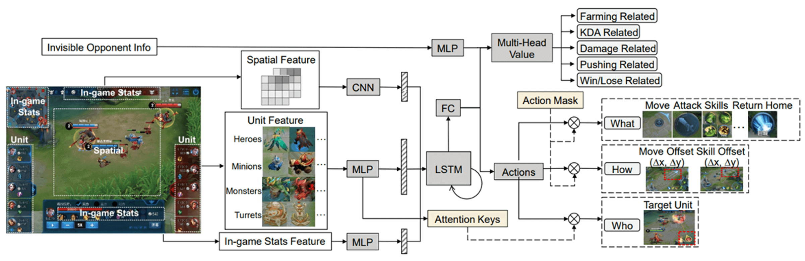

> Ye, Deheng, Guibin Chen, Wen Zhang, Sheng Chen, Bo Yuan, Bo Liu, Jia Chen et al. "Towards playing full moba games with deep reinforcement learning." Advances in Neural Information Processing Systems 33 (2020): 621-632.

主要关注点：

- (CNN+MLP) - LSTM 的 Encoder-Decoder 结构
- Multi-Head Value，通过分组改进 Value 估计效果，降低方差
- 使用全局 Perfect Information 辅助 Value 估计

> 其他可能的优化方向

- 更合理的解码和预测 —— 时序处理部分，进一步增强建模效果/计算效率；预测部分，实现更完整、更复杂的 Attention 设计
- 更高的参数效率或 FLOPs 效率 —— 采用更高效的网络结构；优化结构超参数，对效果不敏感的模块减少冗余参数或计算
- 更强的编解码表征能力 —— 更大规模的 Attention，比如 Transformer Encoder - Decoder 结构，或 Transformer Encoder - RNN Decoder 结构
- 后置规则（处理模型输出）

  > 具体可以在`agent.exploit`中实现，在评估时可以生效；在`agent.train_predict`中实现，在训练时可以生效。

  通过开发后置规则，可以支持实现模型输出 -> 动作的二次映射。特定实现下，从 RL Agent 视角看，等价于环境的变化。

### 奖励机制

> 具体参考[回报设计](#回报计算方法)

可能的优化方向包括：

- 调整奖励子项权重
  - 静态权重
  - 局内动态权重（e.g. 奖励局内衰减）
- 新增奖励项目

### 学习策略

- 由于实验需要考察3个英雄，如果模型对某个英雄过拟合，则可能在其他两个英雄表现不佳，需要谨慎地考虑其泛化性。
- 课程学习：将复杂、综合的学习目标分解为多阶段、更小规模的学习任务。

  通过预训练模型 + 多阶段训练的方式，分步实现总体学习目标。

  例子：通过局间奖励衰减，实现稠密奖励到稀疏奖励的过渡

  - 训练前期，偏重具体行为相关的稠密奖励，引导智能体学会基本操作
  - 训练中期，增强与对局结果强相关的稠密奖励，引导智能体在单局中建立优势
  - 训练后期，调高稀疏奖励权重，引导智能体直接关注最终胜负

> 参考资料
> 
> Narvekar, Sanmit, et al. "[Curriculum learning for reinforcement learning domains: A framework and survey.](https://arxiv.org/abs/2003.04960)" The Journal of Machine Learning Research 21.1 (2020): 7382-7431.
> 
> Lilian Weng. "[[Blog] Curriculum for Reinforcement Learning.](https://lilianweng.github.io/posts/2020-01-29-curriculum-rl/)" (2020)

### 对手模型

> 可参考[训练中评估](#训练中评估)

可能的优化方向包括：

- 根据设计，在不同训练阶段设计适当的对手模型，包括common_ai，self-play，具体对手模型等，根据不同的组合和比例引导训练
- 自定义评估对局，根据评估对局反馈的情况对训练方案进行针对性的优化设计

### 算法优化

- 强化学习算法优化：其他条件不变，强化学习算法越高效，收敛至同等能力所需时间越短
  - Dual-Clip PPO / Value Clip

    对 policy loss 进行双重 clip，避免 advantage 取值 outlier 对收敛稳定性的影响。

    类似地，可以对 value loss 进行 clip，避免单步更新幅度过大对 value network 收敛的影响。

  - Value Normalization

    > Yu, Chao, Akash Velu, Eugene Vinitsky, Yu Wang, Alexandre Bayen, and Yi Wu. "The surprising effectiveness of ppo in cooperative, multi-agent games." *arXiv preprint arXiv:2103.01955* (2021).

    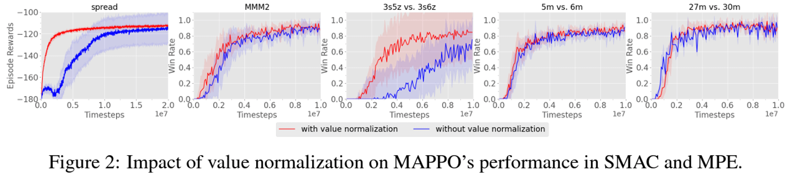

    对于策略梯度方法，伴随着 RL 过程，value network 学习目标的变化可能比较剧烈，影响了 value 估计的学习效果，进而影响了整体收敛效果与稳定性。实验表明，通过引入 Value 归一化，类 PPO 算法的样本效率可能获得改善。

  - PPG 算法

    > Cobbe, Karl W., Jacob Hilton, Oleg Klimov, and John Schulman. "Phasic policy gradient." In *International Conference on Machine Learning*, pp. 2020-2027. PMLR, 2021.

    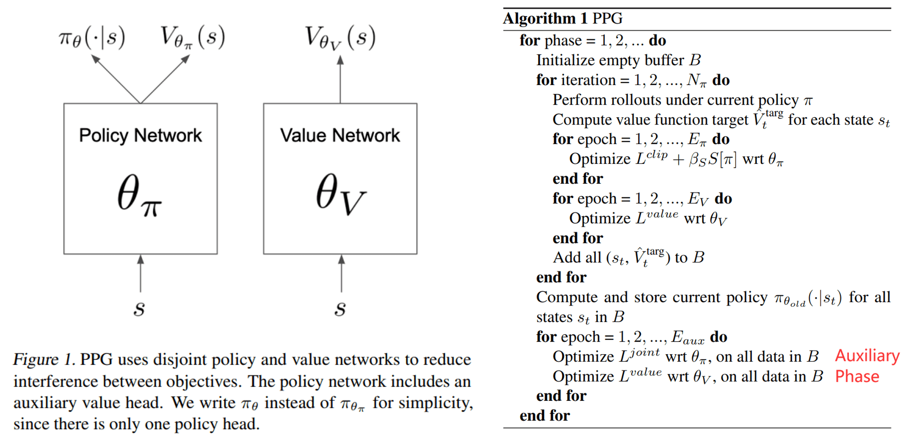

    PPO 算法的一种改进版本，通过改进 value network 训练，提高了样本效率。通过将 value 和 policy 的训练分开交替进行，整合了两种方案：a) 策略与价值支路共享网络； b) 采用独立双网络。传统上，共享网络方案能够帮助共享参数部分学到有用的公共表征，而独立网络方案能够避免不同学习目标之间的干扰—— policy network 应该基于 on-policy 样本进行评估，value network 则完全可以充分利用 off-policy 数据。

  - SAC 算法

    > Haarnoja, Tuomas, Aurick Zhou, Pieter Abbeel, and Sergey Levine. "Soft actor-critic: Off-policy maximum entropy deep reinforcement learning with a stochastic actor." In *International conference on machine learning*, pp. 1861-1870. PMLR, 2018.

    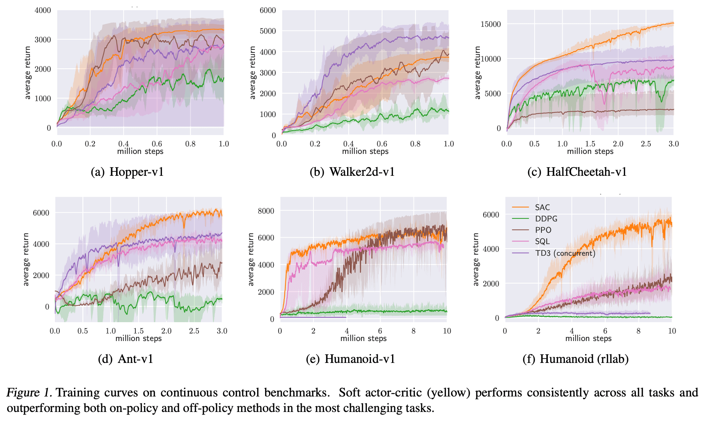

    PPO 存在 on-policy 假设，而分布式强化学习场景下，为了实现更高效的并行计算，在 on-policy 程度上存在妥协。SAC 是一种 off-policy 的随机策略 RL 算法，在样本利用方式上和 DDPG 类似，区别在于其生成 stochastic policy，在部分 benchmark 中表现出优于 DDPG 的样本效率。

  - 考虑到更换 PPO 算法涉及较大的开发和调试工作量，推荐大部分队伍优先考虑在 PPO 算法基础上的优化，学有余力的队伍可以直接尝试更换算法。

---

## 工具

### 代码调试

在代码包的根目录，我们提供了代码测试脚本`train_test.py`，该脚本将使用算法文件夹下`train_workflow.py`中的`workflow`进行一次训练，当训练步数＞0时判定本次代码测试通过。通过启动一次训练，脚本能够迅速验证流程中的各个环节是否正确进行，确保训练逻辑的准确性。

为避免训练模型时出现因代码问题导致的错误，我们建议用户在正式训练前一定要对代码进行测试。操作如下：

1. 将`train_test.py`文件中`algorithm_name`的值修改为需要测试的算法名，算法名需要是`algorithm_name_list`中的一个。
2. 进入IDE工具栏的【运行与调试】工具，点击下图所示绿色箭头的 **运行** 按钮。启动后，IDE会开始对代码进行测试，并将运行结果输出到右侧面板下方的终端区域，以方便用户进行观察和分析。

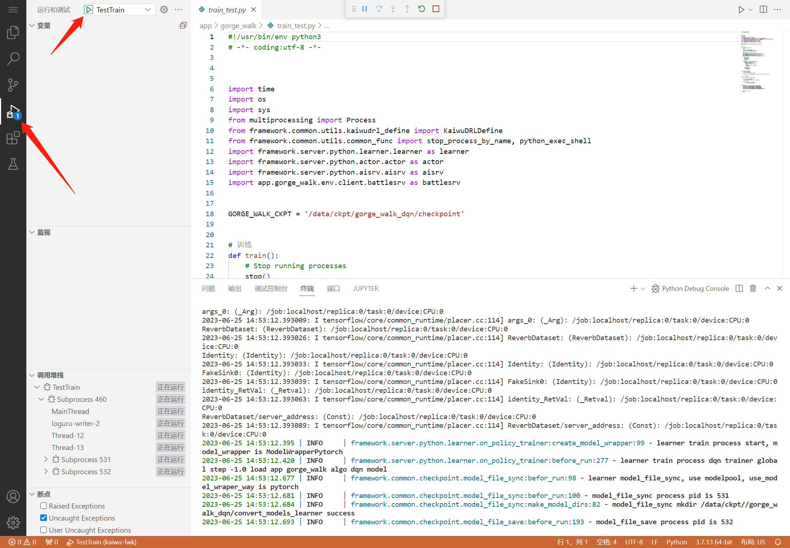

在代码测试过程中如果遇到错误，则测试流程自动中止。此时用户可以根据下方的终端面板查看错误信息，根据错误信息定位代码的问题。

如果没有遇到错误，则代码测试流程会在一次强化训练结束后自动终止（几分钟左右，请耐心等待），并在下方的终端面板提示Train test succeed。

---

### 训练监控及日志

#### 训练监控

有关训练监控的详细信息，请参阅[训练监控介绍](#监控介绍)。

#### 日志

用户可以直接使用腾讯开悟平台的强化学习框架提供的日志句柄进行日志记录。以下是标准的日志输出格式。

| 字段名 | 字段描述 | 实现 |
| --- | --- | --- |
| time | 时间 | 2024-09-18 19:33:04.813469 |
| level | 日志级别 | INFO |
| message | 日志内容 | kaiwu learner train process now train count is 365676, global step is 365676 |
| file | 代码文件 | on_policy_trainer.py |
| line | 代码行数 | 769 |
| module | 日志模块 | learner |
| process | 运行的进程名 | on_policy_trainer |
| function | 函数名 | train_stat |
| stack | 堆栈 | 如果出现错误需要打印堆栈输出查询问题 |

> **注意** ：若用户对日志系统进行重写，监控面板将无法获取对应日志的错误数量，显示**No data**。

---

# 数据协议

## 原始帧状态信息

对应`observation[agent_id]["frame_state"]`

### FrameState

| 类型 | 字段说明 | 字段名 | 字段类型 | 备注 |
| --- | --- | --- | --- | --- |
| FrameState | 帧结构 | frameNo | signed int | 帧号 |
| FrameState | 帧结构 | hero_states | vector, HeroState | 英雄状态列表 |
| FrameState | 帧结构 | npc_states | vector, ActorState | 非英雄角色状态列表 |
| FrameState | 帧结构 | bullets | vector, Bullet | 子弹列表 |
| FrameState | 帧结构 | cakes | vector, Cake | 功能物件列表(血包等) |
| FrameState | 帧结构 | equip_infos | vector, EquipInfo | 装备信息列表 |
| FrameState | 帧结构 | frame_action | vector, FrameAction | 死亡事件 |
| FrameState | 帧结构 | map_state | bool | 大乱斗地图坍塌状态，false未坍塌，true已坍塌 |

### HeroState

| 类型 | 字段说明 | 字段名 | 字段类型 | 备注 |
| --- | --- | --- | --- | --- |
| HeroState | 英雄属性 | player_id | signed int | 玩家id |
| HeroState | 英雄属性 | actor_state | ActorState | 角色状态 |
| HeroState | 英雄属性 | skill_state | SkillState | 技能状态 |
| HeroState | 英雄属性 | equip_state | EquipState | 装备状态 |
| HeroState | 英雄属性 | buff_state | BuffState | BUFF状态 |
| HeroState | 英雄属性 | level | signed int | 等级 |
| HeroState | 英雄属性 | exp | signed int | 经验 |
| HeroState | 英雄属性 | money | signed int | 金钱 |
| HeroState | 英雄属性 | revive_time | signed int | 复活时间 |
| HeroState | 英雄属性 | killCnt | signed int | 击杀次数 |
| HeroState | 英雄属性 | deadCnt | signed int | 死亡次数 |
| HeroState | 英雄属性 | assistCnt | signed int | 助攻次数 |
| HeroState | 英雄属性 | moneyCnt | signed int | 经济总量 |
| HeroState | 英雄属性 | totalHurt | signed int | 总输出 |
| HeroState | 英雄属性 | totalHurtToHero | signed int | 对英雄伤害输出 |
| HeroState | 英雄属性 | totalBeHurtByHero | signed int | 承受英雄伤害 |
| HeroState | 英雄属性 | passive_skill | vector, PassiveSkill | 被动技能 |
| HeroState | 英雄属性 | real_cmd | vector, CmdPkg | 实际执行指令 |
| HeroState | 英雄属性 | takeHurtInfos | vector, TakeHurtInfo | 承受伤害序列 |
| HeroState | 英雄属性 | canAbortCurSkill | bool | 是否可以打断当前技能 |
| HeroState | 英雄属性 | returnCityAbortInfo | vector, ReturnCityAbortInfo | 打断当前技能信息 |
| HeroState | 英雄属性 | isInGrass | bool | 判断英雄是否在草丛中 |
| HeroState | 英雄属性 | protectInfo | vector, ProtectInfo | 护盾信息 |
| HeroState | 英雄属性 | canBuyEquip | bool | 是否可以购买装备 |

### ActorState

| 类型 | 字段说明 | 字段名 | 字段类型 | 备注 |
| --- | --- | --- | --- | --- |
| ActorState | 角色状态 | config_id | signed int | 区分英雄 |
| ActorState | 角色状态 | runtime_id | signed int | 区分红蓝方 |
| ActorState | 角色状态 | actor_type | ActorType | Actor主类型 |
| ActorState | 角色状态 | sub_type | ActorSubType | Actor子类型 |
| ActorState | 角色状态 | camp | enum, COM_PLAYERCAMP | 所属阵营: 区分红蓝方 |
| ActorState | 角色状态 | behav_mode | enum, ObjBehaviMode | 角色当前行为状态(比如死亡等) |
| ActorState | 角色状态 | location | VInt3 | 位置 |
| ActorState | 角色状态 | forward | VInt3 | 朝向 |
| ActorState | 角色状态 | hp | signed int | 当前血量 |
| ActorState | 角色状态 | max_hp | signed int | 最大血量 |
| ActorState | 角色状态 | values | ActorValue | 英雄属性 |
| ActorState | 角色状态 | abilities | bool | 能力状态 |
| ActorState | 角色状态 | attack_range | signed int | 攻击范围 |
| ActorState | 角色状态 | attack_target | signed int | 攻击目标 |
| ActorState | 角色状态 | kill_income | signed int | 含金值 |
| ActorState | 角色状态 | hit_target_info | vector, HitTargetInfo | 命中的目标 |
| ActorState | 角色状态 | camp_visible | vector, bool | 可见阵营，camp_visible[0]表示是否蓝方可见，camp_visible[1]表示是否红方可见 |
| ActorState | 角色状态 | sight_area | signed int | 视野 |
| ActorState | 角色状态 | buff_state | ActorBuffState | Buff状态 |
| ActorState | 角色状态 | hurt_hero_state | HurtHeroInfo | 对英雄的伤害 |

### SkillState

| 类型 | 字段说明 | 字段名 | 字段类型 | 备注 |
| --- | --- | --- | --- | --- |
| SkillState | 技能状态 | slot_states | vector, SkillSlotState | 技能槽 |

### ActorValue

| 类型 | 字段说明 | 字段名 | 字段类型 | 备注 |
| --- | --- | --- | --- | --- |
| ActorValue | 英雄属性 | phy_atk | signed int | 物理攻击 |
| ActorValue | 英雄属性 | phy_def | signed int | 物理防御 |
| ActorValue | 英雄属性 | mgc_atk | signed int | 魔法攻击 |
| ActorValue | 英雄属性 | mgc_def | signed int | 魔法防御 |
| ActorValue | 英雄属性 | mov_spd | signed int | 移动速度 |
| ActorValue | 英雄属性 | atk_spd | signed int | 攻速加成 |
| ActorValue | 英雄属性 | ep | signed int | 当前能量 |
| ActorValue | 英雄属性 | max_ep | signed int | 最大能量 |
| ActorValue | 英雄属性 | hp_recover | signed int | 生命回复 |
| ActorValue | 英雄属性 | ep_recover | signed int | 能量回复 |
| ActorValue | 英雄属性 | phy_armor_hurt | signed int | 物理护甲穿透 |
| ActorValue | 英雄属性 | mgc_armor_hurt | signed int | 魔法护甲穿透 |
| ActorValue | 英雄属性 | crit_rate | signed int | 爆击率 |
| ActorValue | 英雄属性 | crit_effe | signed int | 爆击效果 |
| ActorValue | 英雄属性 | phy_vamp | signed int | 物理吸血 |
| ActorValue | 英雄属性 | mgc_vamp | signed int | 魔法吸血 |
| ActorValue | 英雄属性 | cd_reduce | signed int | 冷却缩减 |
| ActorValue | 英雄属性 | ctrl_reduce | signed int | 韧性 |

### SkillSlotState

| 类型 | 字段说明 | 字段名 | 字段类型 | 备注 |
| --- | --- | --- | --- | --- |
| SkillSlotState | 技能槽状态 | configId | signed int | 配置ID |
| SkillSlotState | 技能槽状态 | slot_type | SkillSlotType | 技能槽 |
| SkillSlotState | 技能槽状态 | level | signed int | 等级 |
| SkillSlotState | 技能槽状态 | usable | bool | 能否使用 |
| SkillSlotState | 技能槽状态 | cooldown | signed int | CD剩余时长 |
| SkillSlotState | 技能槽状态 | cooldown_max | signed int | CD总长 |
| SkillSlotState | 技能槽状态 | usedTimes | signed int | 释放次数 |
| SkillSlotState | 技能槽状态 | hitHeroTimes | signed int | 命中英雄释放次数 |
| SkillSlotState | 技能槽状态 | succUsedInFrame | signed int | 当前帧成功使用次数 |
| SkillSlotState | 技能槽状态 | nextConfigID | signed int | 多段技能的下一个技能id |
| SkillSlotState | 技能槽状态 | comboEffectTime | signed int | 组合技激活余留时间 |

### EquipState

| 类型 | 字段说明 | 字段名 | 字段类型 | 备注 |
| --- | --- | --- | --- | --- |
| EquipState | 装备列表 | equips | vector, EquipSlot | 装备列表 |

### EquipSlot

| 类型 | 字段说明 | 字段名 | 字段类型 | 备注 |
| --- | --- | --- | --- | --- |
| EquipSlot | 装备槽 | configId | signed int | 配置ID（对应装备配置表） |
| EquipSlot | 装备槽 | buyPrice | signed int | 购买单价 |
| EquipSlot | 装备槽 | amount | signed int | 数量 |
| EquipSlot | 装备槽 | active_skill | vector, ActiveSkill | 主动技能 |
| EquipSlot | 装备槽 | passive_skill | vector, PassiveSkill | 被动技能 |

### BuffState

| 类型 | 字段说明 | 字段名 | 字段类型 | 备注 |
| --- | --- | --- | --- | --- |
| BuffState | BUFF状态 | buff_skills | vector, BuffSkillState | 产生的BUFF组 |
| BuffState | BUFF状态 | buff_marks | vector, BuffMarkState | 印记状态组 |

### BuffMarkState

| 类型 | 字段说明 | 字段名 | 字段类型 | 备注 |
| --- | --- | --- | --- | --- |
| BuffMarkState | 印记状态 | origin_actorId | signed int | 施放者ID |
| BuffMarkState | 印记状态 | configId | signed int | 配置ID |
| BuffMarkState | 印记状态 | layer | signed int | 层数 |

### BuffSkillState

| 类型 | 字段说明 | 字段名 | 字段类型 | 备注 |
| --- | --- | --- | --- | --- |
| BuffSkillState | BUFF技能状态 | configId | signed int | 配置ID |
| BuffSkillState | BUFF技能状态 | startTime | uint64 | 开始时间 |
| BuffSkillState | BUFF技能状态 | times | signed int | 生效次数 |
| BuffSkillState | BUFF技能状态 | effectType | signed int | 类型 |

### CmdPkg

| 类型 | 字段说明 | 字段名 | 字段类型 | 备注 |
| --- | --- | --- | --- | --- |
| CmdPkg | 指令信息 | command_type | enum, CommandType | 指令类型 |
| CmdPkg | 指令信息 | prm_move_pos | PrmMovePos | 指向目标移动命令参数 |
| CmdPkg | 指令信息 | prm_move_dir | PrmMoveDir | 指向方向移动命令参数 |
| CmdPkg | 指令信息 | prm_attack_common | PrmAttackCommon | 普通攻击命令参数 |
| CmdPkg | 指令信息 | prm_attack_topos | PrmAttackToPos | 移动施法命令参数 |
| CmdPkg | 指令信息 | prm_attack_actor | PrmAttackActor | 锁定目标命令参数 |
| CmdPkg | 指令信息 | prm_obj_skill | PrmObjSkill | 目标性技能命令参数 |
| CmdPkg | 指令信息 | prm_dir_skill | PrmDirSkill | 方向性技能命令参数 |
| CmdPkg | 指令信息 | prm_pos_skill | PrmPosSkill | 位置性技能命令参数 |
| CmdPkg | 指令信息 | prm_learn_skill | PrmLearnSkill | 学习技能命令参数 |
| CmdPkg | 指令信息 | prm_buy_equip | PrmBuyEquip | 购买装备命令参数 |
| CmdPkg | 指令信息 | prm_sell_equip | PrmSellEquip | 出售装备命令参数 |

### PrmMovePos

| 类型 | 字段说明 | 字段名 | 字段类型 | 备注 |
| --- | --- | --- | --- | --- |
| PrmMovePos | 指向目标移动命令参数 | destPos | VInt3 | 目标位置 |

### VInt3

| 类型 | 字段说明 | 字段名 | 字段类型 | 备注 |
| --- | --- | --- | --- | --- |
| VInt3 | | x | signed int | x坐标 |
| VInt3 | | y | signed int | y坐标 |
| VInt3 | | z | signed int | z坐标 |

### PrmMoveDir

| 类型 | 字段说明 | 字段名 | 字段类型 | 备注 |
| --- | --- | --- | --- | --- |
| PrmMoveDir | 指向方向移动命令参数 | degree | int | 角度 |
| PrmMoveDir | 指向方向移动命令参数 | seq | int | 序号 |

### PrmAttackCommon

| 类型 | 字段说明 | 字段名 | 字段类型 | 备注 |
| --- | --- | --- | --- | --- |
| PrmAttackCommon | 普通攻击命令参数 | start | int | 0按下, 1抬起 |
| PrmAttackCommon | 普通攻击命令参数 | actorID | int | 目标actor的runtime id |

### PrmAttackToPos / PrmAttackActor

| 类型 | 字段说明 | 字段名 | 字段类型 | 备注 |
| --- | --- | --- | --- | --- |
| PrmAttackToPos | 移动施法命令参数 | destPos | VInt3 | 目标位置 |
| PrmAttackActor | 锁定目标命令参数 | actorID | int | 目标actor的runtime id |

### PrmObjSkill / PrmDirSkill / PrmPosSkill

| 类型 | 字段说明 | 字段名 | 字段类型 | 备注 |
| --- | --- | --- | --- | --- |
| PrmObjSkill | 目标性技能命令参数 | actorID | int | 目标actor的runtime id |
| PrmObjSkill | 目标性技能命令参数 | skillID | int | 技能ID |
| PrmObjSkill | 目标性技能命令参数 | slotType | enum, SkillSlotType | 施放技能槽 |
| PrmDirSkill | 方向性技能命令参数 | actorID | int | 目标actor的runtime id |
| PrmDirSkill | 方向性技能命令参数 | skillID | int | 技能ID |
| PrmDirSkill | 方向性技能命令参数 | slotType | enum, SkillSlotType | 施放技能槽 |
| PrmDirSkill | 方向性技能命令参数 | degree | int | 施法角度 |
| PrmPosSkill | 位置性技能命令参数 | destPos | VInt3 | 目标位置 |
| PrmPosSkill | 位置性技能命令参数 | skillID | int | 技能ID |
| PrmPosSkill | 位置性技能命令参数 | slotType | enum, SkillSlotType | 施放技能槽 |

### PrmLearnSkill

| 类型 | 字段说明 | 字段名 | 字段类型 | 备注 |
| --- | --- | --- | --- | --- |
| PrmLearnSkill | 学习技能 | slotType | enum, SkillSlotType | 目标技能槽 |
| PrmLearnSkill | 学习技能 | level | int | 目标技能等级 |

### PrmBuyEquip / PrmSellEquip

| 类型 | 字段说明 | 字段名 | 字段类型 | 备注 |
| --- | --- | --- | --- | --- |
| PrmBuyEquip | 购买装备 | equipId | int | 装备id |
| PrmBuyEquip | 购买装备 | obj_id | int | 英雄runtime id |
| PrmSellEquip | | equipIndex | int | 装备槽位 |

### ProtectInfo

| 类型 | 字段说明 | 字段名 | 字段类型 | 备注 |
| --- | --- | --- | --- | --- |
| ProtectInfo | 护盾信息 | protectType | ProtectType | 护盾类型 |
| ProtectInfo | 护盾信息 | protectValue | unsigned int32 | 护盾值 |

### HitTargetInfo

| 类型 | 字段说明 | 字段名 | 字段类型 | 备注 |
| --- | --- | --- | --- | --- |
| HitTargetInfo | 命中目标信息 | hit_target | signed int | 命中目标的runtime_id |
| HitTargetInfo | 命中目标信息 | skill_id | signed int | 技能ID |
| HitTargetInfo | 命中目标信息 | slot_type | enum, SkillSlotType | 施放技能槽 |

### ActorBuffState

| 类型 | 字段说明 | 字段名 | 字段类型 | 备注 |
| --- | --- | --- | --- | --- |
| ActorBuffState | buff状态 | buff_skills | vector, BuffSkillState | 产生的BUFF组 |
| ActorBuffState | buff状态 | buff_marks | vector, BuffMarkState | 印记状态组 |

### Bullet

| 类型 | 字段说明 | 字段名 | 字段类型 | 备注 |
| --- | --- | --- | --- | --- |
| Bullet | 子弹信息 | runtime_id | signed int | 运行时id |
| Bullet | 子弹信息 | camp | COM_PLAYERCAMP | 所属阵营 |
| Bullet | 子弹信息 | source_actor | signed int | 源actorID |
| Bullet | 子弹信息 | slot_type | SkillSlotType | 施放技能槽 |
| Bullet | 子弹信息 | skill_id | signed int | 所属技能 |
| Bullet | 子弹信息 | location | VInt3 | 当前位置 |
| Bullet | 子弹信息 | action | string | 子弹AGE |
| Bullet | 子弹信息 | born_pos | VInt3 | 生成位置 |
| Bullet | 子弹信息 | use_dir | VInt3 | 使用方向 |
| Bullet | 子弹信息 | use_frame | uint32 | 使用帧号 |
| Bullet | 子弹信息 | sight_range | signed int | 视野范围 |
| Bullet | 子弹信息 | target_actor | signed int | 目标actorID |
| Bullet | 子弹信息 | size | VInt3 | 碰撞物大小（目前只考虑box类型） |

### Cake

| 类型 | 字段说明 | 字段名 | 字段类型 | 备注 |
| --- | --- | --- | --- | --- |
| Cake | 功能物件 | configId | signed int | 配置ID(对应神符配置表) |
| Cake | 功能物件 | collider | SphereCollider | 碰撞体 |

### EquipInfo

| 类型 | 字段说明 | 字段名 | 字段类型 | 备注 |
| --- | --- | --- | --- | --- |
| EquipInfo | 装备信息 | equip_id | signed int | 装备ID |
| EquipInfo | 装备信息 | equip_price | signed int | 装备价格 |
| EquipInfo | 装备信息 | equip_atoms | signed int | 子装备ID |

### FrameAction

| 类型 | 字段说明 | 字段名 | 字段类型 | 备注 |
| --- | --- | --- | --- | --- |
| FrameAction | 帧状态 | dead_action | DeadAction | 死亡事件 |

### DeadAction

| 类型 | 字段说明 | 字段名 | 字段类型 | 备注 |
| --- | --- | --- | --- | --- |
| DeadAction | 死亡事件 | death | ActionActorInfo | 死亡对象 |
| DeadAction | 死亡事件 | killer | ActionActorInfo | 击杀者 |
| DeadAction | 死亡事件 | assist_set | ActionActorInfo | 助攻者 |

---

# 监控介绍

在腾讯开悟平台的训练管理页面，我们提供了**查看监控**功能，点击后，即可在新标签页中打开监控面板，如下图所示。你可以通过查看监控数据实时定位自己的训练进程，从而帮助大家评更快更准确的找到问题所在。

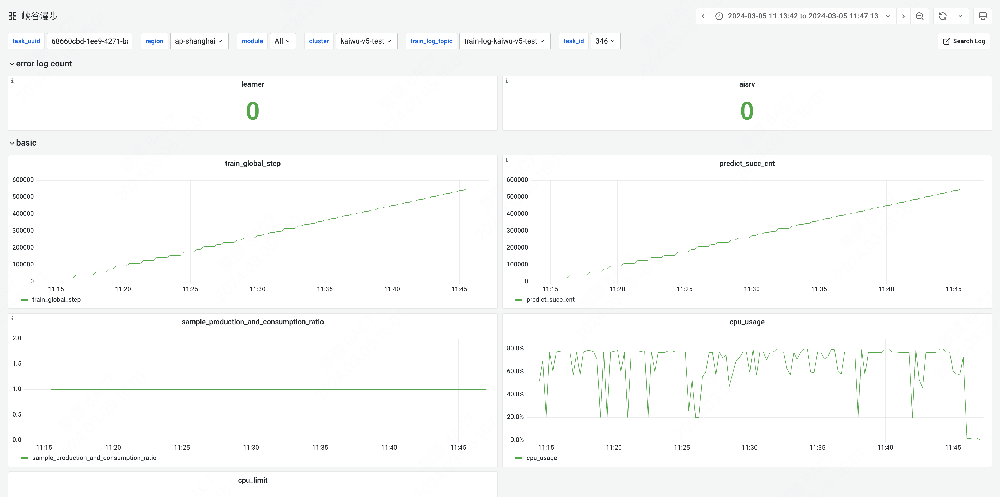

---

## 监控面板介绍

在监控面板中，包括 **错误日志数量** 和 **监控指标图** 两部分内容。

**错误日志数量**：在该模块中，可以看到训练过程中每个模块的错误日志数量。点击模块卡片可以进入日志详情页，查看该模块的错误日志信息。

**监控指标图**：在该模块中，可以看到四类数据指标，分别是**basic**（基础指标）、**algorithm**（算法指标）、**env**（环境指标）、**diy**（自定义指标）。

| 指标分类 | 说明 |
| --- | --- |
| **basic** | 包括强化学习训练过程中的标准数据和资源使用数据。 |
| **hardware** | 和硬件相关的数据指标，体现硬件资源的利用率。 |
| **algorithm** | 和算法相关的数据指标，不同算法上报的指标可能会有所不同。 |
| **env** | 和环境相关的数据指标，不同环境上报的指标不同。 |
| **diy** | 用户自行上报的数据指标。 |

### basic（基础指标）

| 指标名称 | 说明 |
| --- | --- |
| **train_global_step** | 训练的累计步数，即`agent.learn`的调用次数。取决于各算法的具体实现。 |
| **predict_succ_cnt** | 采样预测的累计帧数，即`agent.predict`的调用次数。 |
| **sample_production_and_consumption_ratio** | 等于训练步数除以采样预测的累计帧数。 |
| **episode_cnt** | 已经结束的任务个数。 |

### hardware（硬件指标）

| 指标名称 | 说明 |
| --- | --- |
| **aisrv_cpu_usage** | aisvr的cpu使用占比。 |
| **learner_cpu_usage** | learner的cpu使用占比。 |

### algorithm（算法指标）

| 指标名称 | 说明 |
| --- | --- |
| **reward** | 例如最近10局平均每局的累积回报，反应了智能体的能力，正常训练情况下指标应该是震荡向上。 |
| **total_loss** | 算法计算的所有loss总和。 |
| **value_loss** | 算法计算的值函数的loss。 |
| **policy_loss** | 算法计算的决策动作概率的loss。 |
| **entropy_loss** | 策略的概率分布计算得到的熵loss。 |

### env（环境指标）

不同环境的指标各不相同，有关环境指标的详细介绍，请参考[开发指南-强化学习环境-环境监控信息](#环境监控信息)。

### diy（自定义指标）

我们提供了五个自定义指标`diy_1`至`diy_5`以便用户可以上报自己想要监控的数据。

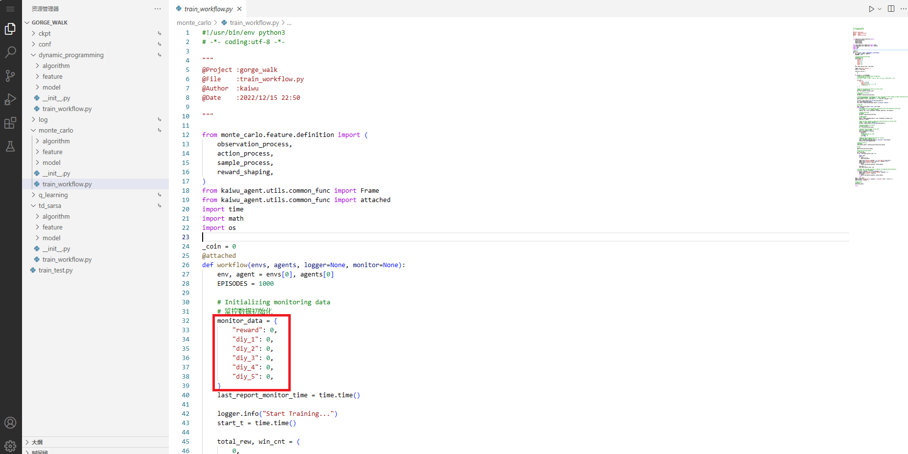

如上图红圈中所示，打开`train_workflow.py`，即可发现我们在此进行了`diy_1`至`diy_5`指标的初始化上报，如需更新此指标，只需在下图中的代码中添加`diy_1`至`diy_5`的新数据，即可完成上报更新。

---
