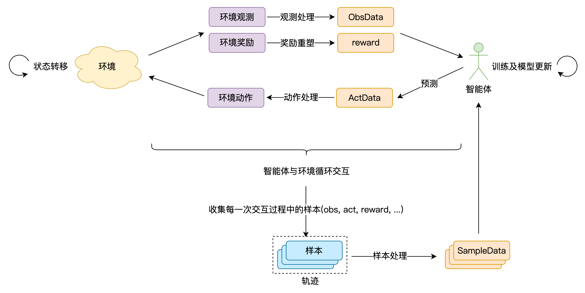
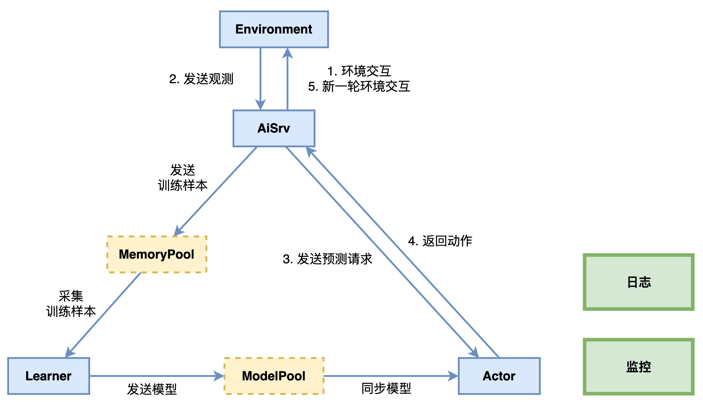

# 综述

> 欢迎来到腾讯开悟！

腾讯开悟强化学习开发框架是基于[强化学习系统系列技术标准](#强化学习系统系列技术标准)打造的标准化开发套件。该框架为开发者提供了标准化的编程接口和丰富的工具集，支持开发者高效完成智能体开发、环境交互，以及模型的训练及预测流程。

## 训练流程简介

本开发框架的完整训练流程如下图所示：



如图，完整训练流程包含以下关键环节：

| 环节 | 介绍 |
| --- | --- |
| **​智能体-环境循环交互** | - 智能体将环境提供的观测和奖励处理为符合预测函数输入要求的数据；<br>- 调用预测函数，生成动作指令；<br>- 将智能体输出的动作指令处理为符合环境输入要求的数据；<br>- 环境执行动作后完成状态转移，并反馈新的观测数据和奖励数据； |
| **样本处理** | - 每个环境有不同的开始与结束逻辑，智能体与环境从开始到结束的完整交互过程，称为episode；<br>- 智能体与环境每一次交互产生的结构化数据，称为**样本**；一个episode产生的样本序列称为**轨迹**；<br>- 对轨迹数据进行处理，转换为规范化**训练样本(SampleData)**； |
| **​模型迭代优化** | - 基于训练样本，通过算法持续更新模型参数，实现策略优化； |
| **智能体模型更新** | - 智能体加载最新模型，与环境继续循环交互； |

该流程通过强化学习分布式计算框架提供的训练工作流实现。基于此，开发框架主要包含三大核心模块：

- [强化学习环境系统](#环境)：提供标准的**强化学习环境接口**。开发者可以通过标准接口，实现智能体与环境的交互。
- [强化学习智能体开发套件](#智能体)：提供标准的**强化学习智能体接口**，以及算法库、模型组件库等工具函数库。开发者可以通过工具函数库快速完成智能体的构建。
- [强化学习分布式计算框架](#分布式计算框架)：提供标准接口，支持开发者按需实现训练工作流，运行单机或分布式的训练及评估任务。

## 代码包简介

开发者可以通过腾讯开悟平台所提供的强化学习项目使用开发框架。一个强化学习项目的代码目录如下：

```
📦 根目录
├── 📂 agent
│   ├── 📂 algorithm
│       └── 📄 __init__.py
│       └── 📄 algorithm.py
│   ├── 📂 conf
│       └── 📄 __init__.py
│       └── 📄 conf.py
│       └── 📄 train_env_conf.toml
│   ├── 📂 feature
│       └── 📄 __init__.py
│       └── 📄 definition.py
│       └── 📄 preprocessor.py
│   ├── 📂 model
│       └── 📄 __init__.py
│       └── 📄 model.py
│   ├── 📂 workflow
│       └── 📄 __init__.py
│       └── 📄 train_workflow.py
│   ├── 📄 __init__.py
│   └── 📄 agent.py
├── 📂 conf
│   ├── 📄 __init__.py
│   ├── 📄 configure_app.toml
├── 📂 log
└── 📄 train_test.py
```

代码目录介绍：

| 目录名 | 介绍 |
| --- | --- |
| **agent/** | 智能体子目录，智能体相关内容均集中于该目录，是开发者核心工作目录。 |
| **conf/** | 配置文件目录，包含运行训练任务相关的配置，例如训练样本批处理大小batch_size等。 |
| **log/** | 日志目录，存放运行代码测试脚本时生成的日志文件。 |
| **train_test.py** | 代码正确性测试脚本，该脚本会使用当前代码包完成一步训练。建议开发者在启动训练任务前，确保代码已通过该脚本检测。 |

### agent

| 目录/文件名 | 介绍 |
| --- | --- |
| **algorithm/** | 算法相关，开发者在该目录下完成算法实现，包含loss计算、模型优化等，详情见[算法开发](#算法开发) |
| **feature/** | 特征相关，开发者在该目录下完成数据结构定义和数据处理方法，以及样本处理和奖励计算，详情见[特征处理](#特征处理) |
| **model/** | 模型相关，开发者在该目录下完成模型实现。 详情见[模型开发](#模型开发) |
| **workflow/** | 工作流目录，开发者在该目录下完成训练工作流的开发。 详情见[工作流开发](#工作流开发) |
| **agent.py** | 智能体核心代码文件，开发者在该文件中完成预测、训练等核心函数的实现。 详情见[智能体开发](#智能体开发) |

标准代码包中都存在一个agent_diy子文件夹，该文件夹是预定义的智能体模板，可供开发者进行智能体的开发。

### conf

| 文件名 | 介绍 |
| --- | --- |
| **configure_app.toml** | 训练任务相关的配置，包括样本大小、样本池大小等。 |

---

通过对训练流程和代码包的介绍，相信开发者能够对腾讯开悟开发框架建立了初步认知。

接下来，我们将详细介绍每个模块的功能及使用方式。

# 环境

在综述中提到，强化学习训练流程离不开智能体与环境的持续交互，本文将详细介绍强化学习环境系统的功能及标准接口函数。

## 概述

强化学习环境是基于输入动作，输出观测、奖励等反馈的功能模块，用于表达强化学习算法所求解的问题场景。

开发框架通过场景适配模块，对仿真器进行封装，将其特化的接口、协议转换为强化学习环境统一的接口和协议，供智能体调用。

强化学习环境系统主要提供如下功能：

1. 接收配置信息，用于指定自身初始化方式，比如环境中各种元素的初始状态。
2. 输出观测、奖励信息，可用于智能体预测、训练。
3. 输出观测、奖励之外的其他信息，供强化学习系统相关组件使用以实现特定功能。其他信息可包括可视化数据、日志数据等，实现的功能包括环境可视化、运行状况监测等。
4. 接收动作指令，完成状态转移并产生新的观测和奖励。

---

## 环境使用

开发框架通过场景适配模块，将问题场景进行标准化封装，为开发者提供统一的交互接口与通信协议。由于环境之间存在差异，接口中所涉及的观测、奖励等信息的具体数据结构也有所不同，开发者需查阅所使用环境的官方数据协议文档以获取准确信息。

开发者可以在[训练工作流](#训练工作流)的workflow中获取到对应环境的实例，通过标准接口实现智能体与环境的交互。

**核心函数介绍**

### reset(usr_conf)

reset会将环境重置为环境配置文件中指定的状态，并且返回初始观测。

```python
# usr_conf为开发者传入的环境配置
obs, state = env.reset(usr_conf = usr_conf)
```

**Parameters**

| 参数名 | 介绍 |
| --- | --- |
| **usr_conf** | dict类型，环境配置文件 |

**Returns**

| 参数名 | 介绍 |
| --- | --- |
| **obs** | dict类型，环境观测信息 |
| **state** | dict类型，环境全局信息 |

---

### step(act, stop_game = false)

环境会执行传入的act动作指令，完成一次状态转移，并返回新的观测和奖励等信息。

```python
frame_no, _obs, score, terminated, truncated, _state = env.step(act, stop_game = false)
```

**Parameters**

| 参数名 | 介绍 |
| --- | --- |
| **act** | dict类型，环境执行的动作 |
| **stop_game** | bool类型，是否结束当前对局 |

**Returns**

| 参数名 | 介绍 |
| --- | --- |
| **frame_no** | int类型，当前环境实例运行时的帧号 |
| **_obs** | dict字典类型，当前帧的观测信息 |
| **score** | int类型，当前帧的奖励信息 |
| **terminated** | bool类型，当前环境实例是否结束 |
| **truncated** | bool类型，当前环境实例是否异常或中断 |
| **_state** | dict字典类型，当前帧的全部状态信息 |

# 智能体

## 综述

智能体是强化学习系统中的核心模块，在[开发框架综述](#综述)中提到，完整训练流程包括：

| 环节 | 介绍 |
| --- | --- |
| **​智能体-环境循环交互** | - 智能体将环境提供的观测和奖励处理为符合预测函数输入要求的数据；<br>- 调用预测函数，生成动作指令；<br>- 将智能体输出的动作指令处理为符合环境输入要求的数据；<br>- 环境执行动作后完成状态转移，并反馈新的观测数据和奖励数据； |
| **样本处理** | - 每个环境有不同的开始与结束逻辑，智能体与环境从开始到结束的完整交互过程，称为episode；<br>- 智能体与环境每一次交互产生的结构化数据，称为**样本**；一个episode产生的样本序列称为**轨迹**；<br>- 对轨迹数据进行处理，转换为规范化**训练样本(SampleData)**； |
| **​模型迭代优化** | - 基于训练样本，通过算法持续更新模型参数，实现策略优化； |
| **智能体模型更新** | - 智能体加载最新模型，与环境继续循环交互； |

基于上述训练流程，我们将智能体的开发分为四个部分：

1. [数据处理及奖励设计](#特征处理)：介绍基于环境观测数据进行特征处理、样本处理和奖励设计的方法。

2. [模型开发](#模型开发)：介绍模型开发接口及开发方法。

3. [算法开发](#算法开发)：介绍包括算法开发接口及开发方法。

4. [工作流开发](#工作流开发)：介绍开发者开发自定义训练工作流的方法。

接下来，将通过独立的章节对强化学习智能体开发套件中每个模块的功能及接口函数进行介绍。

## 特征处理

环境返回的数据通常无法直接作为智能体预测和训练的输入，开发者需要完成特征处理、样本处理和奖励设计，确保数据结构与类型符合智能体的接口规范。

### 特征处理

在特征处理时，开发者需要完成四个关键的开发工作，分别是**定义数据结构**、**观测处理**、**动作处理**。

#### 定义数据结构

> 开发目录：`<智能体文件夹>/feature/definition.py`

首先，开发者需要定义智能体可以使用的数据结构（类）。

开发框架已经预先定义好了三种数据类型：ObsData, ActData, SampleData。

- ObsData和ActData分别表示智能体预测的输入和输出，将会由`agent.predict()`使用；
- SampleData为训练样本的数据类型，训练样本将会被`agent.learn()`使用，进行模型训练。

**核心函数介绍**

##### create_cls

用于动态创建数据结构（类）。ObsData, ActData, SampleData是训练流程必需的三类，但每一个类的数据结构包含哪些属性完全由开发者自定义，属性名称和属性数量没有限制。

```python
ObsData = create_cls("ObsData", 
    feature=None, 
)
ActData = create_cls("ActData", 
    action=None, 
    prob=None, 
)
SampleData = create_cls("SampleData", 
    npdata=None, 
)
```

**Parameters**

| 参数名 | 介绍 |
| --- | --- |
| **第一个参数** | 字符串类型，类的名称 |
| **其余参数** | 类的属性，默认值为None，由开发者自行定义 |

---

#### 观测处理

> 开发目录：`<智能体文件夹>/agent.py`

由于环境的reset和step接口返回的数据属于原始观测数据，无法直接作为智能体预测时的输入，开发者需要将这部分数据进行特征化。

**核心函数介绍**

##### observation_process

将环境返回的观测数据转换成ObsData类型数据。

很多情况下，特征工程包含了大量的数值处理、数据转换和领域知识，我们建议将大量的特征处理代码在`<智能体文件夹>/feature/preprocessor.py`文件中实现，然后由于`observation_process`进行调用。

```python
def observation_process(self, obs, state=None):
    return ObsData(feature=feature, legal_act=legal_actions)
```

**Parameters**

| 参数名 | 介绍 |
| --- | --- |
| **obs** | Observation类型，env.reset和env.step返回的环境观测数据 |
| **state** | EnvInfo类型，env.reset和env.step返回的环境状态数据 |

**Return**

| 参数名 | 介绍 |
| --- | --- |
| **ObsData** | 开发者定义的ObsData类型的数据，将作为`agent.predict()`函数的输入。 |

---

#### 动作处理

> 开发目录：`<智能体文件夹>/agent.py`

由于环境的step接口的输入须要满足环境的特定数据协议，开发者需要将智能体预测的输出转换为符合环境step接口输入要求的数据。

**核心函数介绍**

##### action_process

将智能体预测输出的ActData类型数据转换成环境可以接收的动作数据.

```python
def action_process(self, act_data):
    return act_data.act
```

**Parameters**

| 参数名 | 介绍 |
| --- | --- |
| **act_data** | 开发者定义的ActData类型的数据 |

**Return**

环境能处理的动作数据类型，作为`env.step()`的输入

---

### 奖励设计

> 开发目录：`<智能体名称>/feature/definition.py`

这里的奖励特指强化学习中的Reward，注意要与环境反馈的Score进行区分。Score通常用于衡量智能体在环境中的实际表现。开发者在设计Reward时，有非常大的灵活性，不仅可以基于环境返回的观测信息，还可以加入开发者对问题的理解、经验或者知识。

**核心函数介绍**

##### reward_shaping

开发框架预设的奖励设计函数接口，开发者可以通过该函数实现复杂的奖励计算，在训练工作流中调用。

```python
def reward_shaping(obs, _obs, state, _state):
    return reward
```

**Parameters**

参数个数和类型不限制，可以是环境信息、智能体信息、开发者的经验和知识等。

**Return**

数值类型，计算出的reward值

---

### 样本处理

> 开发目录：`<智能体文件夹>/feature/definition.py`

由于环境与智能体交互过程中产生的轨迹数据无法直接作为智能体训练时的输入，开发者需要将轨迹数据转换为训练样本数据。

**核心函数介绍**

##### sample_process

将环境与智能体交互过程中产生的轨迹数据转换成开发者定义的SampleData类型数据。

```python
@attached
def sample_process(self, list_game_data):
    return [SampleData(**i.__dict__) for i in list_game_data]
```

**Parameters**

| 参数名 | 介绍 |
| --- | --- |
| **list_game_data** | list(Frame)类型， 使用开发者自定义的Frame作为输入，因为样本一般进行批处理，所以传入列表 |

**Return**

| 参数名 | 介绍 |
| --- | --- |
| **list(SampleData)类型** | SampleData类型的数据组成的列表 |

---

为了支持分布式训练，样本数据需要进行网络传输，由于SampleData无法直接进行网络传输，需要先转换成Numpy的Array，待传输到对端之后再由np.Array转换成SampleData。

因此，开发者需要实现两个转换函数 `SampleData2NumpyData`和 `NumpyData2SampleData`，这两个函数互为反函数。

> **注意**：由于这两个函数会被分布式计算框架调用，因此这两个函数的实现都必须包含一个装饰器@attached

##### SampleData2NumpyData

将SampleData转换为NumpyData。

```python
@attached
def SampleData2NumpyData(g_data):
    return g_data.npdata
```

**Parameters**

| 参数名 | 介绍 |
| --- | --- |
| **g_data** | SampleData 类型 |

**Return**

Numpy.array类型

---

##### NumpyData2SampleData

将NumpyData转换为SampleData。

```python
@attached
def NumpyData2SampleData(s_data):
    return SampleData(npdata=s_data)
```

**Parameters**

| 参数名 | 介绍 |
| --- | --- |
| **s_data** | Numpy.array 类型 |

**Return type**

SampleData类型

## 算法开发

> 开发目录：`<智能体名称>/algorithm/algorithm.py`

在完成特征处理和奖励设计后，开发者还需要实现强化学习算法，以通过特定优化方法更新模型参数。

以下为实现强化学习算法的核心函数介绍，有关函数的更多细节可以查阅[分布式计算框架](#分布式计算框架)

**核心函数介绍**

### learn

实现强化学习优化算法的核心方法，该函数输入为训练样本数据，开发者需基于不同的算法完成相关实现，包括优化方法、损失计算等。

```python
def learn(self, list_sample_data):
    """
    Implementing the core method of the algorithm
    实现算法的核心方法
    """
    loss = 0                         # 基于不同算法实现loss计算 Calculate loss
    loss.backward()                  # 计算梯度 Calculate gradient
    self.optimizer.step()            # 通过梯度下降等方法更新模型 Update weights 
```

**Parameters**

| 参数名 | 介绍 |
| --- | --- |
| **list_sample_data** | list类型，训练样本(SampleData)列表 |

## 模型开发

> 开发目录：`<智能体名称>/model/model.py`

一个强化学习模型是基于特征作为输入数据，输出策略的神经网络模型。

开发者需要在`model.py`文件中，实现神经网络模型。开发框架要求，模型类需继承 `torch.nn.Module` 类，即符合Pytorch模型的实现规范。

```python
class Model(nn.Module):
    def __init__(self, state_shape, action_shape=0, softmax=False):
        super().__init__()
```

## 工作流开发

### 训练工作流

在完成智能体开发后，需要进一步实现由[分布式计算框架](#分布式计算框架)提供的训练工作流接口，使智能体和环境持续交互，收集训练样本，迭代模型参数，最终完成策略的优化。

**核心函数介绍**

### workflow

通过该函数实现强化学习训练工作流，调用智能体和环境提供的接口，完成环境交互、样本收集和模型更新。

```python
@attached
def workflow(envs, agents, logger=None, monitor=None):
```

**Parameters**

| 参数名 | 介绍 |
| --- | --- |
| **envs** | list类型，环境列表，返回当前正在运行的环境。 |
| **agents** | list类型，智能体列表，通过调用开发者实现的 `<智能体名称>/agent.py` 实例化 Agent, 并作为输入传入 `workflow`。 |
| **logger** | Logger类型，框架提供的日志组件，接口与 python 的 `logging` 库一致。 |
| **monitor** | Monitor类型，框架提供的监控组件。 |

---

接下来，我们将通过一个训练工作流关键步骤的代码示例（具体实现由开发者完成），说明如何通过训练工作流实现完整训练流程。

```python
@attached
def workflow(envs, agents, logger=None, monitor=None):
    # Get the environment and agent
    # 获取环境和智能体
    env, agent = envs[0], agents[0]

    # Execute several epochs
    # 执行若干次epoch
    epoch_num = 1000
    
    # Each epoch executes several episodes
    # 每个epoch执行若干个episode
    episode_num_every_epoch = 1000

    # Training loop
    # 训练循环
    for epoch in range(epoch_num):
        # After each episode, the trajectory data is converted into training samples for training.
        # 在每一个episode结束之后，将轨迹数据转换成训练样本进行训练
        for g_data in run_episodes(episode_num_every_epoch, env, agent, logger, monitor):
            # Agent training. If single-machine training, the model is trained directly; if distributed training, samples are sent to the sample-pool.
            # agent进行训练。如果是单机训练，则直接对模型进行训练；如果是分布式训练，则将训练样本发送到样本池。
            agent.learn(g_data)
            # Ensure that the next training sample collected is new
            # 清空g_data，确保下一次搜集的训练样本是新的
            g_data.clear()
        
        # Save the model at intervals
        # 依据时间间隔保存模型
        now = time.time()
        if now - last_save_model_time >= 300:
            agent.save_model()
            last_save_model_time = now
            

def run_episodes(n_episode, env, agent, logger, monitor):
    # Run several episodes
    # 运行若干个episode
    for episode in range(n_episode):
        # Reset data at the beginning of an episode
        # 在episode开始时重置数据
        done = False
        collector = list()

        # Reset enviroment and get initial info
        # 重置环境, 并获取环境初始状态
        obs, state = env.reset(usr_conf=usr_conf)

        # Load the latest model and call it on demand; if in stand-alone mode, there is no need to load the remote model
        # 加载最新模型，按需调用；若训练采用单机模式，则无需加载远程模型，可不调用该函数
        agent.load_model(id="latest")

        # Run an episode loop
        # 运行一个episode循环
        while not done:
            # Agent performs inference, gets the predicted action for the next frame
            # 调用智能体预测函数，获取下一时刻的动作
            act_data = agent.predict(list_obs_data=[obs_data])[0]

            # Unpack ActData into action
            # 将智能体输出的ActData数据转换为符合环境数据协议要求的动作数据
            act = agent.action_process(act_data)

            # Interact with the environment, execute actions, get the next state
            # 调用环境step接口，与环境交互, 执行动作, 获取下一时刻的状态
            frame_no, _obs, score, terminated, truncated, _state = env.step(act)
            if _obs == None:
                break

            # Feature processing
            # 对环境返回的观测数据进行处理
            _obs_data = agent.observation_process(_obs, _state)

            # Disaster recovery
            # 容灾
            if truncated and frame_no == None:
                break

            # Calculate reward
            # 计算reward
            reward = reward_shaping(obs_data, _obs_data, state, _state)

            # Episode done signal
            # episode结束信号
            done = terminated or truncated

            # Construct sample
            # 构造样本
            frame = Frame(
                obs=obs_data.feature,
                _obs=_obs_data.feature,
                act=act,
                rew=reward,
                done=done,
            )
            collector.append(frame)

            # If the game is over, the sample is processed and sent to training
            # 如果episode结束，则进行样本处理，将样本送去训练
            if done:
                if len(collector) > 0:
                    collector = sample_process(collector)
                    # Return samples
                    # 返回样本数据, agent会调用agent.learn(g_data)进行训练
                    yield collector
                break

            # Status update
            # 状态更新
            obs_data = _obs_data
            obs = _obs
            state = _state
```

## 智能体开发

> 开发目录：`<智能体名称>/agent.py`

在完成模型和算法后，开发者还需要实现强化学习智能体，智能体使用模型进行决策、与环境交互并通过算法更新模型参数。

以下为实现强化学习智能体的核心函数介绍，有关函数的更多细节可以查阅[分布式计算框架](#分布式计算框架)

**核心函数介绍**

### learn

该函数输入为训练样本数据，开发者需要在该函数中调用算法消费训练样本进行训练。  

当然，在不同的训练模式下，该函数使用方法有所不同：

- 单机训练：开发者需要在训练工作流中手动调用该函数以进行一步训练。
- 分布式训练：
  - 该函数作为训练函数会被循环执行，无需开发者手动调用。
  - 但该函数还作为样本发送函数，开发者需要在训练工作流中手动调用，以将样本发送至样本池。

```python
def learn(self, list_sample_data):
    self.algo.learn(list_sample_data)        # 调用算法消费训练样本进行训练 Call algorithm to train model
```

**Parameters**

| 参数名 | 介绍 |
| --- | --- |
| **list_sample_data** | list类型，训练样本(SampleData)列表 |

---

### predict

该方法通过调用模型进行预测，通常在训练时调用该方法，依策略的概率分布采样或引入随机概率。

```python
@predict_wrapper
def predict(self, list_obs_data, list_state):
    return [ActData]
```

**Parameters**

| 参数名 | 介绍 |
| --- | --- |
| **list_obs_data** | list类型，观测数据(ObsData)列表 |
| **list_state** | 可选参数，list类型，环境返回的状态数据列表 |

**Return**

| 参数名 | 介绍 |
| --- | --- |
| **List(ActData)** | list类型，开发者定义的动作数据(ActData)列表 |

---

### exploit

该方法通过调用模型进行预测，通常在评估时调用该方法，选取策略中概率最高的动作或者策略认为最优的动作。

```python
@exploit_wrapper
def exploit(self, observation):
```

**Parameters**

| 参数名 | 介绍 |
| --- | --- |
| **observation** | dict类型，环境观测字典，评估工作流中将原始的环境观测信息作为输入传入 `agent.exploit()`。 |

**Return**

| 参数名 | 介绍 |
| --- | --- |
| **action** | list类型，动作列表，环境可以直接使用的动作指令 |

---

### load_model

智能体通过该接口完成模型参数加载。在上文中提到，Actor会从模型池中获取最新模型参数文件，开发者需要手动调用`load_model()`函数，使智能体完成模型参数加载。

```python
@load_model_wrapper
def load_model(self, path=None, id="1"):
    # When loading the model, you can load multiple files,
    # and it is important to ensure that each filename matches the one used during the save_model process.
    # 加载模型, 可以加载多个文件, 注意每个文件名需要和save_model时保持一致
    model_file_path = f"{path}/model.ckpt-{str(id)}.pkl"
    self.model.load_state_dict(
        torch.load(model_file_path, map_location=self.device),
    )
```

**Parameters**

| 参数名 | 介绍 |
| --- | --- |
| **path** | string类型，加载模型参数文件的路径，开发框架根据使用场景得到相应的路径, 并作为输入传入 `load_model` |
| **id** | string类型，模型参数文件的 id，使用 id 指定加载的模型参数文件 |

---

### save_model

开发者可以通过该函数保存当前时刻的模型文件及智能体代码包，开发框架会将开发者需要保存的内容打包为zip格式的文件。

当开发者使用腾讯开悟客户端开发时，开发框架会在客户端指定目录下存储该zip文件。

当开发者使用腾讯开悟平台时，开发框架会将该zip文件存储在云端，开发者可以通过平台的训练管理模块查看每一个训练任务的zip文件，即模型。

```python
@save_model_wrapper
def save_model(self, list_obs_data, list_state):
    # To save the model, it can consist of multiple files,
    # and it is important to ensure that each filename includes the "model.ckpt-id" field.
    # 保存模型, 可以是多个文件, 需要确保每个文件名里包括了model.ckpt-id字段
    model_file_path = f"{path}/model.ckpt-{str(id)}.pkl"

    # Copy the model's state dictionary to the CPU
    # 将模型的状态字典拷贝到CPU
    model_state_dict_cpu = {k: v.clone().cpu() for k, v in self.model.state_dict().items()}
    torch.save(model_state_dict_cpu, model_file_path)
```

**Parameters**

| 参数名 | 介绍 |
| --- | --- |
| **path** | string类型，模型文件保存的路径，开发框架根据使用场景得到相应的路径, 并作为输入传入 `save_model` |
| **id** | string类型，模型文件的索引，开发框架获取到模型池中最新模型的索引, 并作为输入传入 `save_model` |

# 分布式计算框架

在强化学习项目的开发中，​分布式计算框架是支撑大规模训练任务的核心基础设施。本开发框架提供了由腾讯王者荣耀团队自主研发的强化学习分布式计算框架KaiwuDRL，通过并行化计算、高效资源调度和分布式协同优化，显著提升智能体训练的效率与稳定性。

接下来，我们将详细介绍KaiwuDRL的系统架构与核心能力，帮助开发者进一步理解训练和评估工作流的运行逻辑。

## 总体架构



### 组件介绍

如上图所示，KaiwuDRL 的整体架构包括 Environment、Aisrv、Actor、Learner 等强化学习组件（均支持多实例并行运行）。此外，还集成了通信、日志、监控、对象存储等基础组件。

组件介绍如下表：

| 组件名称 | 功能描述 |
| --- | --- |
| Environment | 环境服务组件，负责运行强化学习环境，支持通过标准接口与环境交互，并返回环境的观测obs。 |
| Aisrv | 训练流程中枢，负责收集环境样本，运行训练、评估工作流，以及处理各个组件间的数据传输。 |
| Actor | 预测服务组件，负责响应Aisrv的预测请求，调用智能体 predict() 或 exploit() 函数生成动作决策结果。 |
| Learner | 训练服务组件，负责采集训练样本，调用智能体 learn() 函数完成梯度计算及模型迭代。 |
| MemoryPool | 样本存储组件，简称样本池。负责存储训练样本，接收 Aisrv 打包的训练样本，发往 Learner 用于智能体训练。 |
| ModelPool | 模型存储组件，简称模型池。负责存储模型参数文件，接收 Learner 产出的模型参数文件，将最新的模型参数文件发送给Actor。 |
| 日志 | 日志采集组件，负责记录强化学习系统中各个组件的运行日志，支持通过标准接口上报日志。 |
| 监控 | 监控采集组件，负责采集系统资源使用率、训练指标趋势等数据，支持通过标准接口上报数据指标。 |

> **MemoryPool和ModelPool仅在分布式训练时启用。**

---

### 服务介绍

基于上述组件，KaiwuDRL 提供了预测服务和训练服务：

#### 预测服务

1. Aisrv → Environment：发送环境配置并创建新一局episode；
2. Environment → Aisrv：返回原始观测数据；
3. Aisrv → Actor：Aisrv基于原始观测数据，向Actor发送预测请求；
4. Actor：使用预测请求中的观测进行特征处理，智能体基于特征处理后的数据进行预测，并且将预测数据处理为环境可以识别的动作指令，发送给Aisrv；
5. Aisrv：使用动作指令与环境Environment进行交互，Environment返回新的观测；

#### 训练服务

1. Aisrv：预测服务不断产生轨迹数据，Aisrv完成样本处理，并发送至样本池；
2. Learner：从样本池按批采集样本进行训练，并将最新的模型参数同步至Actor；

---

## 工作流

KaiwuDRL提供了训练、评估工作流的接口函数，开发者可以按需灵活调用上述组件和服务，以实现模型的训练和评估。

### 训练工作流

> 开发目录：`<智能体名称>/workflow/train_workflow.py`

#### workflow

训练工作流的核心函数，在workflow中可自定义训练流程。可以在[智能体/工作流开发](#工作流开发)中查看详细的训练工作流代码示例。

```python
@attached
def workflow(envs, agents, logger=None, monitor=None):
```

**Parameters**

| 参数名 | 介绍 |
| --- | --- |
| **envs** | list类型，环境列表，返回当前正在运行的环境。 |
| **agents** | list类型，智能体列表，通过调用开发者实现的 `<智能体名称>/agent.py` 实例化 Agent, 并作为输入传入 `workflow`。 |
| **logger** | Logger类型，框架提供的日志组件，接口与 python 的 `logging` 库一致。 |
| **monitor** | Monitor类型，框架提供的监控组件。 |

---

### 评估工作流

在运行训练任务（训练工作流）并获得模型文件后，可以通过运行评估任务（评估工作流），对模型能力进行验证。

当开发者在使用腾讯开悟平台所提供的强化学习项目时，评估工作流由腾讯开悟官方实现，开发者无法修改。评估工作流会调用开发者自定义的`agent.exploit()`函数。

---

## Agent

KaiwuDRL提供了智能体相关的接口函数，开发者可以按需实现以下接口函数，并在训练工作流中调用。

> 开发目录：`<智能体名称>/agent.py`

### learn

该函数输入为训练样本数据，开发者需要在该函数中调用算法消费训练样本进行训练。  

当然，在不同的训练模式下，该函数使用方法有所不同：

- 单机训练：开发者需要在训练工作流中手动调用该函数以进行一步训练。
- 分布式训练：
  - 该函数作为训练函数会被循环执行，无需开发者手动调用。
  - 但该函数还作为样本发送函数，开发者需要在训练工作流中手动调用，以将样本发送至样本池。

```python
@learn_wrapper
def learn(self, list_sample_data):
```

**Parameters**

| 参数名 | 介绍 |
| --- | --- |
| **list_sample_data** | list类型，训练样本(SampleData)列表，Learner从样本池按照配置项`train_batch_size`采样一批样本, 作为输入传入 `learn()` 函数。 |

**配置项**

> 开发目录: `/conf/configure_app.toml`

Learner在每一次执行`learn()`函数时，会从样本池采样一批样本作为输入。并按照开发者配置的频次`dump_model_freq`保存模型参数文件，模型同步服务将按照配置`model_file_sync_per_minutes`将模型参数文件推送至模型池。

Actor中的模型同步服务将按照配置`model_file_sync_per_minutes`，从模型池获取最新模型参数文件。

相关配置项如下：

```yaml
[app]
# The time interval for executing the learn() function, configurable to throttle the Learner and balance sample production/consumption.
# 执行learn函数进行训练的时间间隔，可通过该配置让Learner休息以调节样本生产消耗比
learner_train_sleep_seconds = 0.001

# Replay buffer configurations
# 样本池容量
replay_buffer_capacity = 4096

# The ratio of the sample pool capacity that triggers training
# 当样本池中的样本占总容量的比例达到该值时，启动训练
preload_ratio = 1.0

# When new samples are added to the sample pool, the logic for removing old samples: reverb.selectors.Lifo, reverb.selectors.Fifo
# 当新样本加入样本池时，旧样本的移除逻辑，可选项：reverb.selectors.Lifo, reverb.selectors.Fifo
# reverb.selectors.Lifo：先进后出(Last In, First Out)
# reverb.selectors.Fifo：先进先出(First In, First Out)
reverb_remover = "reverb.selectors.Fifo"

# The sampling logic of the Learner from the sample pool: reverb.selectors.Fifo, reverb.selectors.Uniform
# Learner从样本池中采样的逻辑，可选项：reverb.selectors.Fifo, reverb.selectors.Uniform
# reverb.selectors.Uniform：Samples are selected uniformly at random from the replay buffer, with each sample having an equal probability of being chosen.
# reverb.selectors.Uniform：从回放缓冲区中随机均匀地选择样本，每个样本被选中的概率相同。
# reverb.selectors.Fifo：Samples are selected in the order they were added to the replay buffer.
# reverb.selectors.Fifo：按照先进先出从回放缓冲区中选择样本。
reverb_sampler = "reverb.selectors.Uniform"

# Training batch size limit for Learner
# Learner训练时样本批处理大小
train_batch_size = 2048

# Model dump frequency (steps)
# 训练间隔多少步输出模型参数文件
dump_model_freq = 1000

# The Learner pushes model updates, and the frequency at which Actors fetch the model (in minutes).
# Learner推送模型参数文件至模型池，以及Actor从模型池获取模型参数文件的频次（单位：分钟）
model_file_sync_per_minutes = 1

# he number of model updates pushed per learner iteration, and the maximum number of updates each actor can fetch at once (cap: 50).
# Learner每次推送模型参数文件，以及Actor每次获取模型参数文件的数量（上限：50）
modelpool_max_save_model_count = 1
```

---

### predict

该方法通过调用模型进行预测，通常在训练时调用该方法，依策略的概率分布采样或引入随机概率。

```python
@predict_wrapper
def predict(self, list_obs_data, list_state):
    return [ActData]
```

**Parameters**

| 参数名 | 介绍 |
| --- | --- |
| **list_obs_data** | list类型，观测数据(ObsData)列表 |
| **list_state** | 可选参数，list类型，环境返回的状态数据列表 |

**Return**

| 参数名 | 介绍 |
| --- | --- |
| **List(ActData)** | list类型，开发者定义的动作数据(ActData)列表 |

---

### exploit

该方法通过调用模型进行预测，通常在评估时调用该方法，选取策略中概率最高的动作或者策略认为最优的动作。

```python
@exploit_wrapper
def exploit(self, observation):
```

**Parameters**

| 参数名 | 介绍 |
| --- | --- |
| **observation** | dict类型，环境观测字典，评估工作流中将原始的环境观测信息作为输入传入 `agent.exploit()`。 |

**Return**

| 参数名 | 介绍 |
| --- | --- |
| **action** | list类型，动作列表，环境可以直接使用的动作指令 |

---

### load_model

智能体通过该接口完成模型参数加载。在上文中提到，Actor会从模型池中获取最新模型参数文件，开发者需要手动调用`load_model()`函数，使智能体完成模型参数加载。

```python
@load_model_wrapper
def load_model(self, path=None, id="1"):
  # When loading the model, you can load multiple files,
    # and it is important to ensure that each filename matches the one used during the save_model process.
    # 加载模型, 可以加载多个文件, 注意每个文件名需要和save_model时保持一致
    model_file_path = f"{path}/model.ckpt-{str(id)}.pkl"
    self.model.load_state_dict(
        torch.load(model_file_path, map_location=self.device),
    )
```

**Parameters**

| 参数名 | 介绍 |
| --- | --- |
| **path** | string类型，加载模型参数文件的路径，开发框架根据使用场景得到相应的路径, 并作为输入传入 `load_model` |
| **id** | string类型，模型参数文件的 id，使用 id 指定加载的模型参数文件 |

---

### save_model

开发者可以通过该函数保存当前时刻的模型文件及智能体代码包，开发框架会将开发者需要保存的内容打包为zip格式的文件。

当开发者使用腾讯开悟客户端开发时，开发框架会在客户端指定目录下存储该zip文件。

当开发者使用腾讯开悟平台时，开发框架会将该zip文件存储在云端，开发者可以通过平台的训练管理模块查看每一个训练任务的zip文件，即模型。

```python
@save_model_wrapper
def save_model(self, path=None, id="1"):
      # To save the model, it can consist of multiple files,
    # and it is important to ensure that each filename includes the "model.ckpt-id" field.
    # 保存模型, 可以是多个文件, 需要确保每个文件名里包括了model.ckpt-id字段
    model_file_path = f"{path}/model.ckpt-{str(id)}.pkl"

    # Copy the model's state dictionary to the CPU
    # 将模型的状态字典拷贝到CPU
    model_state_dict_cpu = {k: v.clone().cpu() for k, v in self.model.state_dict().items()}
    torch.save(model_state_dict_cpu, model_file_path)
```

**Parameters**

| 参数名 | 介绍 |
| --- | --- |
| **path** | string类型，模型文件保存的路径，开发框架根据使用场景得到相应的路径, 并作为输入传入 `save_model` |
| **id** | string类型，模型文件的索引，开发框架获取到模型池中最新模型的索引, 并作为输入传入 `save_model` |

---

## 其他功能

### 加载预训练模型

本框架支持在已有的模型（称为预训练模型）基础上继续训练。预训练模型结构和继续训练的模型结构需保持一致。

- 当使用腾讯开悟平台时，在创建训练任务时，可以在弹窗中选择预训练模型以继续训练。

- 当使用腾讯开悟客户端时，需要将训练好的模型文件（`客户端工作空间/ckpt`路径下的pkl类型文件）放入代码包中，并在代码包`conf/configure_app.toml`中完成预训练模型相关的配置，配置说明如下：

```yaml
# Whether to enable the preload model function. If enabled (true), the model specified by preload_model_id will be loaded as the initial model in the preload_model_dir directory; if disabled (false), no preloading will be performed.
# 是否启用加载预训练模型功能，若开启(true)，将在preload_model_dir目录下加载由preload_model_id指定的模型作为初始模型；若关闭(false)，则不加载预训练模型。
preload_model = false

# The relative path of the preloaded model folder (the variable name {agent_name} refers to the agent_algorithm name directory in the code package). It is only effective when preload_model=true. When the preload model function is enabled, you need to create a new ckpt folder under the agent_algorithm name directory in the code package and place the model file (.pkl) there.
# 预训练模型文件夹相对路径(变量名{agent_name}指代码包中agent_算法名目录)，仅在preload_model=true时生效；当开启加载预训练模型功能时，需要在代码包中agent_算法名目录下新建ckpt文件夹，将模型文件（.pkl）放置此即可。
preload_model_dir = "{agent_name}/ckpt"

# The identification ID of the preloaded model (here refers to the number of model training steps). This ID corresponds to the number of training steps recorded in the model file name. It only takes effect when preload_model=true.
# Note that it is forbidden to modify the original model file name, otherwise the model preloading process will fail.
# 预训练模型的标识ID（这里指模型训练步数），该ID对应模型文件名中的训练步数记录。仅在preload_model=true时生效。
# 注意，禁止修改原始模型文件名，否则将导致预训练模型加载失败。
preload_model_id = 1000
```

> **客户端继续训练使用示例**
> 
> 以加载 40052步的DQN模型 为例：
> - 解压模型压缩包，在ckpt路径下找到名为 `model.ckpt-40052.pkl` 的模型文件
> - 将模型文件放到代码包路径下，例如在<code>agent_dqn</code>内新建一个<code>ckpt</code>目录，放入上述模型文件
> - 在代码包<code>conf/configure_app.toml</code>中完成以下配置：
> 
> ```yaml
> preload_model = true
> preload_model_dir = "agent_dqn/ckpt"
> preload_model_id = 40052
> ```
> 
> 完成上述步骤后，Aisrv和Learner将加载预训练模型以继续训练。

### 加载对手模型功能

在使用腾讯开悟平台时，部分项目支持从平台的模型管理中加载自定义模型。

用户可以在 `kaiwu.json` 文件中配置期望用作对手模型的模型 ID。智能体通过 `load_opponent_agent()` 函数完成对手模型的加载。

该功能允许智能体加载指定的网络结构和参数，并根据模型文件中的实现调用 agent 的`reset`、`predict`、`exploit`等方法。

对手模型作为固定水平的自定义模型，可以在 PVP 任务中用于训练评估，以反映训练过程中模型水平的提高。

以下是`load_opponent_agent()`函数示例：

```python
@load_opponent_agent_wrapper
def load_opponent_agent(self, id="1"):
    # Framework provides loading opponent agent function, no need to implement function content
    # 框架提供的加载对手模型功能，无需实现函数内容
    pass
```

**Parameters**

| 参数名 | 介绍 |
| --- | --- |
| **id** | string类型，平台模型管理的 模型id，使用 id 指定加载的模型文件 |

以下是kaiwu.json的配置示例：

```json
{
    "model_pool": [609, 608]
}
```

# 监控与日志

腾讯开悟强化学习开发框架为开发者提供了监控与日志服务，开发者可以按需上报数据指标、记录日志。

### 监控

在腾讯开悟平台的训练管理页面，我们提供了**查看监控**功能，点击后，即可在新标签页中打开监控面板，如下图所示。你可以通过查看监控数据实时定位自己的训练进程，从而帮助大家评更快更准确的找到问题所在。


#### 监控面板介绍

在监控面板中，包括 **错误日志数量** 和 **监控指标图** 两部分内容。

**错误日志数量**：在该模块中，可以看到训练过程中每个模块的错误日志数量。点击模块卡片可以进入日志详情页，查看该模块的错误日志信息。

**监控指标图**：在该模块中，可以看到四类数据指标，分别是**basic**（基础指标）、**algorithm**（算法指标）、**env**（环境指标）、**diy**（自定义指标）。

| 指标分类 | 说明 |
| --- | --- |
| **basic** | 包括强化学习训练过程中的标准数据和资源使用数据。 |
| **hardware** | 和硬件相关的数据指标，体现硬件资源的利用率。 |
| **algorithm** | 和算法相关的数据指标，不同算法上报的指标可能会有所不同。 |
| **env** | 和环境相关的数据指标，不同环境上报的指标不同。 |
| **diy** | 开发者自行上报的数据指标。 |

##### basic（基础指标）

| 指标名称 | 说明 |
| --- | --- |
| **train_global_step** | 训练的累计步数，即`agent.learn`的调用次数。取决于各算法的具体实现。 |
| **predict_succ_cnt** | 采样预测的累计帧数，即`agent.predict`的调用次数。 |
| **sample_production_and_consumption_ratio** | 等于训练步数除以采样预测的累计帧数。 |
| **episode_cnt** | 已经结束的任务个数。 |

##### hardware（硬件指标）

| 指标名称 | 说明 |
| --- | --- |
| **aisrv_cpu_usage** | aisvr的cpu使用占比。 |
| **learner_cpu_usage** | learner的cpu使用占比。 |

##### algorithm（算法指标）

在不同环境中，提供的算法各不相同，且每种算法对应的指标也有所区别。有关算法指标的详细介绍，请参考具体的算法。

##### env（环境指标）

不同环境的指标各不相同，有关环境指标的详细介绍，请参考具体的环境文档。

##### diy（自定义指标）

我们提供了五个自定义指标`diy_1`至`diy_5`以便开发者可以上报自己想要监控的数据。


如上图红圈中所示，打开`train_workflow.py`，即可发现我们在此进行了`diy_1`至`diy_5`指标的初始化上报，如需更新此指标，只需在下图中的代码中添加`diy_1`至`diy_5`的新数据，即可完成上报更新。

### 日志

开发者可以直接使用腾讯开悟平台的强化学习框架提供的日志句柄进行日志记录。以下是标准的日志输出格式。

| 字段名 | 字段描述 | 实现 |
| --- | --- | --- |
| time | 时间 | 2024-09-18 19:33:04.813469 |
| level | 日志级别 | INFO |
| message | 日志内容 | kaiwu learner train process now train count is 365676, global step is 365676 |
| file | 代码文件 | on_policy_trainer.py |
| line | 代码行数 | 769 |
| module | 日志模块 | learner |
| process | 运行的进程名 | on_policy_trainer |
| function | 函数名 | train_stat |
| stack | 堆栈 | 如果出现错误需要打印堆栈输出查询问题 |

> **注意** ：若开发者对日志系统进行重写，监控面板将无法获取对应日志的错误数量，显示**No data**。

# 强化学习系统系列技术标准

腾讯开悟联合北京大学、清华大学、中国科学技术大学、同济大学等国内顶尖 AI 研究机构、学术单位以及中国电力科学研究院有限公司、燧原科技等中国科技企业共同制定行业首个覆盖环境接口、智能体框架、平台部署的强化学习系统系列技术标准（以下称"本系列标准"）。

本系列标准将为强化学习系统设计和应用生态构建提供参考和依据，推动环境开发者、算法开发者、应用开发者、平台运营者在统一的框架下展开协作。

旨在打破技术壁垒，降低跨领域协作成本，加速能源动态优化等可持续发展场景的规模化落地，保障多智能体决策系统的安全性与稳定性，推动全球强化学习领域从"技术割裂"走向"生态共治"。

本系列标准详细内容如下：

[《强化学习系统 第1部分 通用要求》](https://www.ccf.org.cn/Standards/ccfbz/ccf-yfbbz/2025-06-05/843338.shtml)

[《强化学习系统 第2部分 强化学习环境技术要求》](https://www.ccf.org.cn/Standards/ccfbz/ccf-yfbbz/2025-06-05/843339.shtml)
